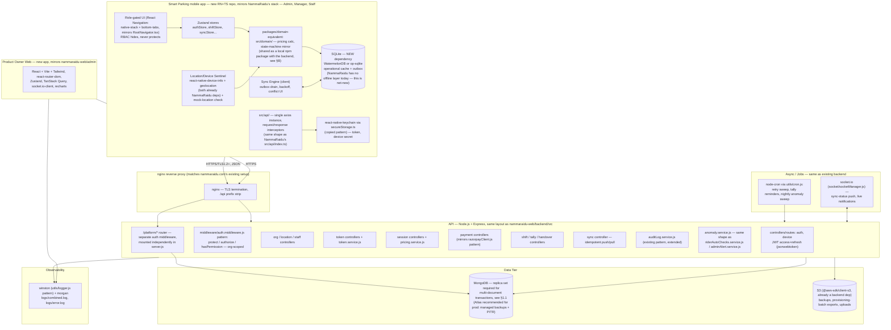
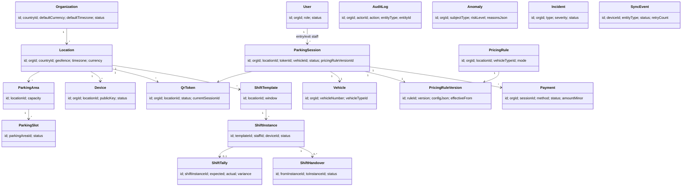
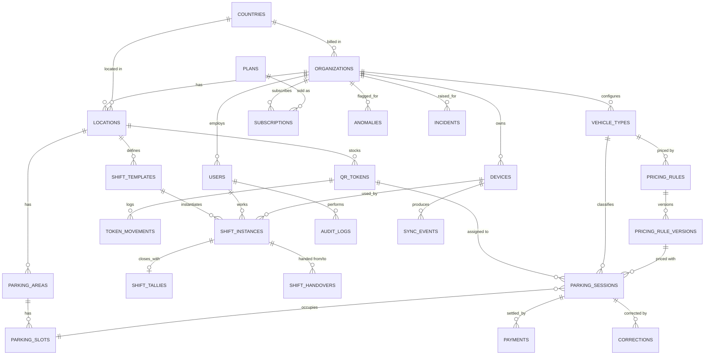
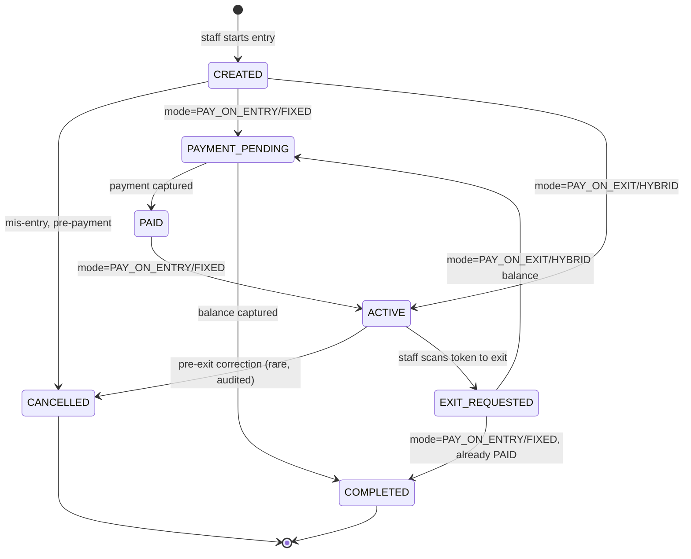
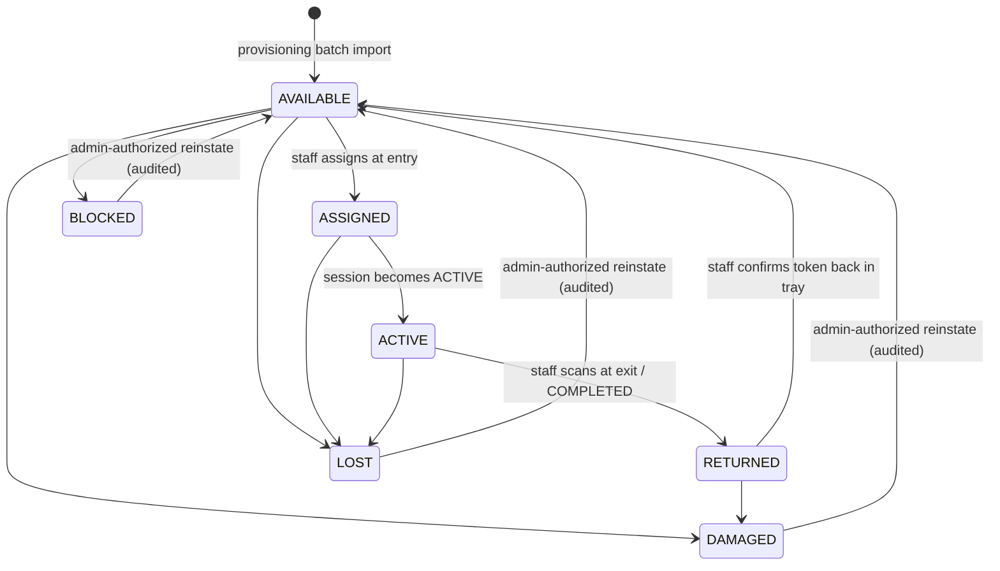
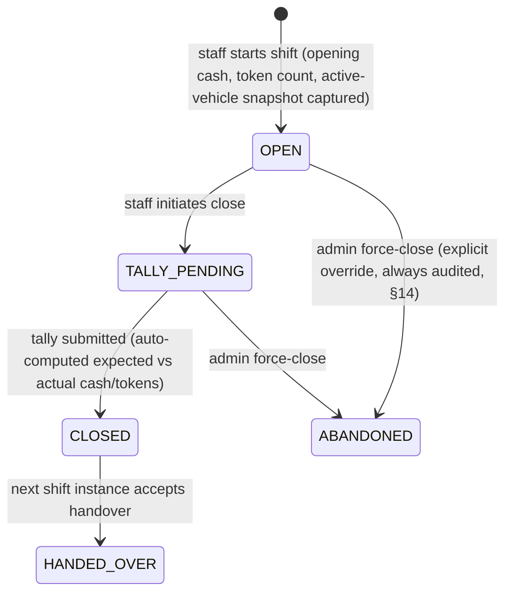
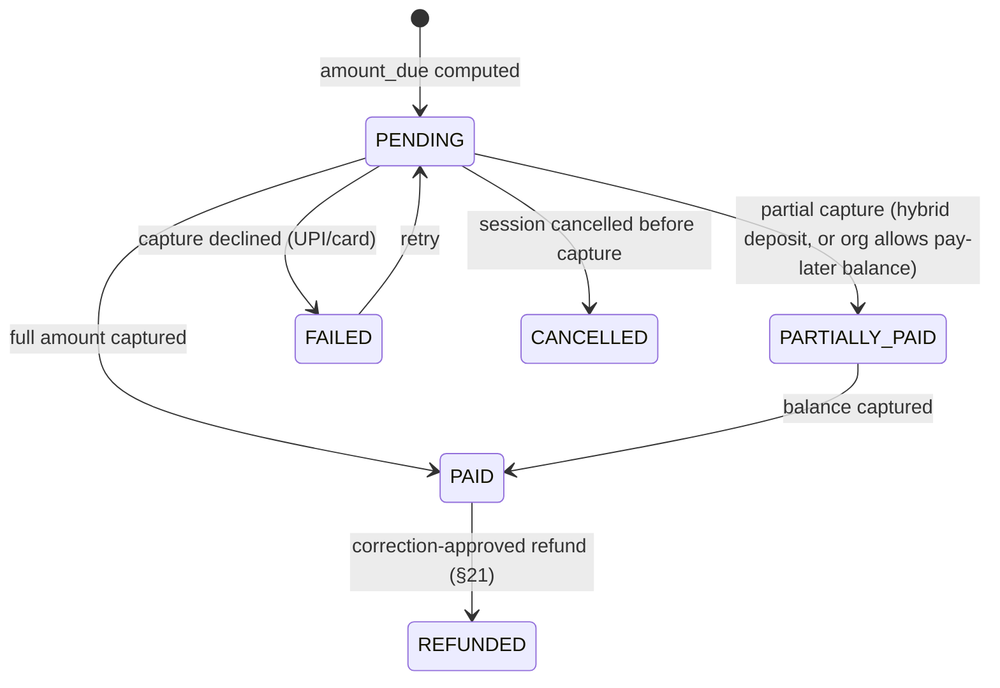
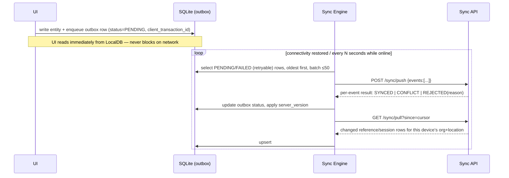
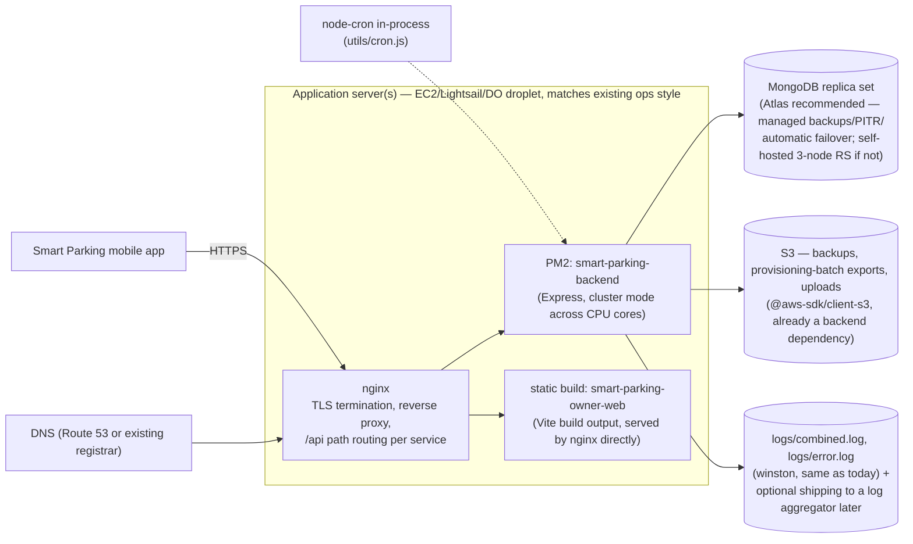

# Smart Parking OS — Phase 0 Architecture

Status: **Design for review — no application code written yet.** Everything below is a proposal. Where a requirement was ambiguous or self-contradictory I've said so explicitly and picked the safest resolution rather than quietly simplifying it. Nothing in the original 48-section brief was dropped; extensions I introduced to close gaps are marked **[NEW]**.

---

## 0. Restated non-negotiables

These drove every decision below and are not up for silent renegotiation:

1. Two apps only — one Android app (Owner/Admin + Manager + Staff via RBAC), one Product Owner web dashboard.
2. No printer. Reusable physical QR tokens, provisioned in bulk, not per-transaction.
3. Pay-on-Exit is the default pricing mode; pricing is versioned and configurable, never hardcoded.
4. Offline-first on the mobile app; automatic background sync; idempotent; bounded retries (no infinite loops).
5. Every sensitive write is bound to staff + shift + device + location, and location/device are verified server-side, layered (never GPS-only).
6. Nothing is hard-deleted once completed; corrections/reversals only. Full audit trail.
7. Multi-tenant, `organization_id`-scoped, zero cross-tenant leakage, global (currency/timezone/tax/language) from day one.
8. Anomaly detection is advisory ("suspicious activity detected — review required"), never an automatic accusation.
9. Backend is the source of truth for every rule. The client is never trusted.

---

## 1. Requirements analysis — gaps, contradictions, and the resolution I'm proposing

This is the most important section to read before touching section A onward, because several downstream designs (schema, state machines) only make sense in light of these calls.

| # | Issue | Why it matters | Resolution adopted |
|---|---|---|---|
| 1 | **"No printer" + "reusable physical QR token" is under-specified.** The brief never says how a token gets physically created or handed to a customer. | Without a provisioning flow, ops can't onboard a new lot. | **[NEW]** Tokens are manufactured/printed **in bulk, offline of any transaction** (e.g., a vendor batch of 500 laminated cards with pre-printed QR + human code), then **provisioned** into the system by an Admin via a `token_provisioning_batch` (CSV/scan-import). A token is a durable *asset*, not a receipt. |
| 2 | **Who physically holds the token between entry and exit?** Never stated. | Determines whether the "QR + NFC" security model is customer-facing or staff-only, and what "wrong location" scanning even means. | **Assumption (flagged, not silently made):** the token behaves like a valet/coat-check claim ticket. Staff assigns it to the vehicle at entry and **hands the physical card to the driver**; the driver returns it at exit; staff scans it back. The QR is scanned by **staff devices only** — there is deliberately no customer-facing scanning app, consistent with "no customer app." |
| 3 | **Session state order contradicts the pay-on-exit flow.** §26 lists `CREATED → ACTIVE → PAYMENT_PENDING → PAID → EXIT_REQUESTED → COMPLETED`, but §12's actual exit flow computes the amount *after* the QR scan (i.e., after "exit is requested"), so `PAID` cannot precede `EXIT_REQUESTED` under Pay-on-Exit. | Getting this wrong makes the default pricing mode literally unrepresentable in the state machine. | The session state machine is **pricing-mode-aware** (full design in §F). `EXIT_REQUESTED` occurs before `PAYMENT_PENDING` for Pay-on-Exit/Hybrid, and before `ACTIVE` for Pay-on-Entry/Fixed-Duration. `COMPLETED` is always the sole terminal success state regardless of mode. |
| 4 | **"Never rely only on GPS" but no alternate signals are specified.** | A pure-GPS check is defeated by mock-location apps in under a minute. | Layered check in §M: GPS **+** Android `LocationManager.isMock`/Play Integrity attestation **+** device-location-history plausibility **+** registered device binding **+** active shift **+** (optional Phase 6) Wi-Fi BSSID/BLE beacon fingerprint of the lot. Any single signal failing degrades trust; multiple failures hard-block. |
| 5 | **What happens to a session whose token is reported LOST while the vehicle is still parked?** Not addressed. | Without an escape hatch, a lost card permanently strands a live session and a live vehicle. | **[NEW]** Manager-authorized **session recovery**: search by vehicle number → issue a replacement token → old token forced `LOST`→(blocked from reissue) → `token_movements` records the substitution → audit event `SESSION_TOKEN_REPLACED`. |
| 6 | **Shift is described as "configurable by location" but real lots run multiple staff concurrently** (e.g., two staff, two devices, overlapping the same "Evening" window). A single shift-per-location model can't express that. | Misdesigning this breaks tally, handover, and accountability — the core of the product. | `shift_templates` define the **schedule** per location (time windows). `shift_instances` are the actual accountable unit, one per **(location, staff, device)** activation. Handover is scoped to one outgoing instance → one incoming instance at one location, not "the location's shift" globally. |
| 7 | **Product Owner dashboard needs cross-org visibility, which superficially conflicts with "no cross-organization leakage."** | If platform admins share the same auth/user table and RBAC path as tenant users, a bug can leak tenant data across orgs or let a tenant escalate into platform scope. | Platform admins are **structurally isolated**: separate `platform_admins` table, separate JWT issuer/audience, separate API base path (`/platform/*`) with its own auth middleware. Tenant RBAC and platform access never share a code path. |
| 8 | **GDPR-style erasure vs. "audit logs are immutable / never deleted."** Not raised in the brief but unavoidable once "global" is a requirement. | A driver or staff member's erasure request cannot be satisfied by deleting an audit row without destroying financial/legal history. | **[NEW]** Never delete audit/financial rows. Support **pseudonymization**: replace `vehicle_number`/free-text PII with a salted hash + reversible-only-by-authorized-support token, keep numeric/financial facts intact. Flagged as a policy question for legal/product to confirm per operating country — documented here as an open risk, not resolved unilaterally. |
| 9 | **Currency handling isn't specified numerically.** | Floating point currency math causes reconciliation drift, which is fatal for a product whose core feature is cash reconciliation. | All money stored as **integer minor units** (paise/cents) with an explicit `currency_code` (ISO 4217) per row, never `float`/`double`. |
| 10 | **"Day" boundary for daily-maximum pricing and overnight shifts is undefined** (calendar day vs. rolling 24h vs. location-local midnight). | Ambiguity here directly changes billed amounts and shift tallies — a compliance/dispute risk. | Daily maximum resets at **location-local midnight** (using the location's IANA timezone), not UTC and not "24h from entry." This is documented per pricing rule and is part of the frozen `pricing_rule_version` so historical bills stay reproducible even if the policy later changes. |
| 11 | **"Offline: shift operations / handover where safe" doesn't say what's unsafe.** | An engineer left to guess will either block too much (kills the offline value prop) or too little (creates unauditable double-accepts). | Explicit split in §22/§J: handover between two staff physically at the same location can be fully **peer-local** (device-to-device isn't required — both act on their own local DB, sync later); what's *not* safe offline is **cross-location** or **cross-organization** operations, which require a server round trip by definition (the server is the only party that knows the current authoritative assignment). |
| 12 | **"Exit as PAID unless business rules permit" is circular** — it defines the rule by referencing itself. | Needed a concrete default so entry/exit flows are implementable. | Default: exit requires `payment.status = PAID` (or `PARTIALLY_PAID` **only** if the org has enabled "pay later" for a vehicle/account) **or** a Manager-authorized override with mandatory reason, which is always audited and always feeds the anomaly engine. |
| 13 | **Vehicle uniqueness isn't specified** — could the same plate have two concurrent sessions? | Needed for a DB constraint. | A vehicle number may have unlimited *historical* sessions, but **at most one non-terminal session per `(organization_id, vehicle_number)`** at a time — enforced with a partial unique index, not just application logic. |
| 14 | **Token uniqueness across state** — could a token be `ASSIGNED` to two sessions? | Same as above — must be a DB-level guarantee, not just server logic, since two devices could race offline and both sync later. | At most one non-terminal session per `(organization_id, token_id)` — partial unique index — plus a server-side conflict rule in §K for the offline race case. |

### 1.1 Alignment pass — following `nammaraidu-web/backend` and `NammaRaidu`

You asked me to follow the existing project flow rather than invent a new one. I read both repos (`C:\Dev\nammaraidu-web\backend`, `C:\Dev\nammaraidu-web\admin`, `C:\Dev\NammaRaidu`) and everything from §A onward below has been re-grounded in their actual conventions — same framework, same folder layout, same auth/response/validation/logging patterns, same client-side libraries. Nothing here is a fresh stack proposal anymore; it's "build the parking system the way this team already builds things." One decision is a genuine fork rather than a small tweak, so I'm flagging it up front instead of picking silently:

| Existing convention (both repos) | Adopted as-is for Smart Parking OS | Why |
|---|---|---|
| Node.js + Express, plain JavaScript (CommonJS), `src/{config,controllers,middleware,models,routes,services,socket,utils}` | **Yes** — same layout, same file-naming (`x.controller.js`, `x.routes.js`, `x.service.js`) | Zero onboarding cost for whoever maintains both products |
| Mongoose ODM, models as `PascalCase.js` with a JSDoc header, `{timestamps:true}` | **Yes** | Same |
| JWT auth (`jsonwebtoken`), `protect`/`authorize`/`hasPermission`/`adminOnly` middleware, `AdminRole`-style role+permissions model | **Yes, extended** with `organizationId` scoping (§O) | Directly reusable; RBAC's own multi-tenant need is the only real gap |
| Joi + `validate(schema, target)` middleware, `createError(status, msg, details)`, global error handler, `{success, message, data}` response envelope | **Yes** | Same (§P/Q rewritten to this shape) |
| Winston logger, morgan (dev), helmet, express-mongo-sanitize, express-rate-limit (general + tighter login limiter), cors allowlist | **Yes** | Same |
| socket.io for realtime (wallet updates, tracking), node-cron for scheduled jobs (`utils/cron.js`), idempotent boot-time seed/migration functions in `server.js` | **Yes** — reused for sync-status push, retry-sweep, tally reminders | Same pattern already solves an equivalent problem (see `riderAutoChecks.service.js`, `adminAlert.service.js` as direct precedent for the anomaly engine, §R) |
| React Native + TypeScript, Zustand stores, React Navigation (native-stack + bottom-tabs), a single axios instance with request/response interceptors, domain-grouped API objects, `react-native-keychain`-backed secure storage, `react-native-device-info`, FCM + Notifee push | **Yes** | Same (§U rewritten to this shape) — this becomes a **new, separate RN app** (own repo, own bundle ID — it's a different product for different users), built with the same libraries and copy-pasted utility patterns (`secureStorage.ts`, the axios interceptor shape) rather than bolted onto NammaRaidu |
| Product-owner-equivalent dashboard already exists as `nammaraidu-web/admin`: React (JS) + Vite + Tailwind + react-router-dom + Zustand + TanStack Query + socket.io-client + recharts + lucide-react + react-hot-toast, `src/{pages,components,context,services,hooks,config}` | **Yes** | Same (§T rewritten to this shape) |
| **Database: MongoDB** | **Flagged, not silently adopted.** Kept relational-grade guarantees *on* MongoDB rather than switching the product to Postgres. See below. | The original brief's §35 explicitly mandated PostgreSQL, specifically for the guarantees this product leans on hardest: partial-unique-index double-exit/double-session prevention, `CHECK`-constrained state enums, multi-table atomicity across token+slot+session+payment. Rule 14 says not to drop a requirement because it's inconvenient, so I didn't drop it — I checked whether Mongo can actually deliver the same guarantees, and it can, with three specific things the existing codebase doesn't currently use anywhere: (a) **partial unique indexes** (`schema.index({...}, {unique:true, partialFilterExpression:{...}})`) for the no-double-session/no-double-token rules in §E; (b) **multi-document ACID transactions**, which require the Mongo deployment to be a **replica set** (a single-node RS is fine for local dev; production needs a real 3-node RS or Atlas — the current `.env.example`'s standalone `mongodb://localhost:27017` won't support transactions as-is, so this is a real infra change, not just a schema one); (c) **Mongoose schema validation + enums** in place of `CHECK` constraints, which the existing models already do informally (see `AdminRole`'s `ALL_PERMISSIONS` enum) but I'm making load-bearing here in a way it isn't yet elsewhere in the codebase. If, after seeing §E, you'd rather keep this one service on Postgres as a deliberate exception (two databases across the org isn't unusual for a genuinely different product), say so and I'll swap it back — but that's your call to make, not mine to assume. |
| **Device identity: asymmetric keypair + request signing (Android Keystore)** | **Simplified.** Neither existing app does public-key request signing anywhere; the ride app's security model is JWT + Keychain-stored token + refresh, full stop. I downgraded §N from a PKI scheme to a per-device shared secret (issued at registration, stored via the same `secureStorage.ts`/Keychain pattern, HMAC-signs requests) — same layered defense-in-depth *intent*, implemented with primitives the team already has in production rather than introducing Keystore asymmetric-key handling as net-new. This is a real (small) security tradeoff — a shared secret is weaker than a private key that never leaves hardware — noted plainly in the revised §N. |

---

## A. Architecture diagram



**Why this replaces the earlier NestJS/Prisma/Postgres/AWS-managed-services proposal:** that proposal was a reasonable green-field default, but it isn't what this team actually runs — `nammaraidu-web/backend` is Express + Mongoose + JS, `NammaRaidu` is RN + TS + Zustand + axios, and `nammaraidu-web/admin` is exactly the product-owner-dashboard shape already, just for a different domain. Following it means the parking system's controllers, middleware, model conventions, error/response envelope, and mobile app patterns are things this team can read on day one without learning a second stack. The one place I kept the original's stricter guarantee (rather than just copying MongoDB in) is the database engine — see §1.1 and §E for why and how.

---

## B. Repository structure

Matching the existing world: **three separate repos**, not a monorepo — `nammaraidu-web` and `NammaRaidu` are already split that way (backend/admin/rider/user/merchant/home all live as siblings, not workspace packages), so Smart Parking OS follows suit rather than introducing a monorepo tool (Turborepo/pnpm workspaces) nobody else here uses.

```
smart-parking-backend/                  # sibling to nammaraidu-web/backend
├── src/
│   ├── config/                         # db.js, firebase.js (if push notif reused), constants
│   ├── controllers/
│   │   ├── auth.controller.js  device.controller.js  org.controller.js
│   │   ├── location.controller.js  staff.controller.js  token.controller.js
│   │   ├── vehicleType.controller.js  pricingRule.controller.js
│   │   ├── session.controller.js  payment.controller.js
│   │   ├── shift.controller.js  handover.controller.js
│   │   ├── sync.controller.js  auditLog.controller.js
│   │   ├── anomaly.controller.js  incident.controller.js  report.controller.js
│   │   └── platform/                   # /platform/* — kept in its own subfolder, never imports tenant controllers
│   │       ├── platformAuth.controller.js  platformOrg.controller.js  platformAnalytics.controller.js  ...
│   ├── middleware/
│   │   ├── auth.middleware.js          # protect / authorize / hasPermission / adminOnly — extended w/ org scoping
│   │   ├── platformAuth.middleware.js  # separate, mirrors auth.middleware.js but reads platform_admins
│   │   ├── validate.middleware.js      # unchanged, reused as-is
│   │   ├── deviceCheck.middleware.js   # NEW — device registered+active
│   │   ├── locationCheck.middleware.js # NEW — layered location verification, §M
│   │   ├── shiftCheck.middleware.js    # NEW — active-shift guard
│   │   └── schemas.js                  # Joi schemas, same convention as existing
│   ├── models/                         # Mongoose, one file per collection — see §E
│   ├── domain/                         # NEW — pure functions: pricing engine, state-machine transition tables
│   │   ├── pricingEngine.js  sessionStateMachine.js  tokenStateMachine.js  shiftStateMachine.js
│   ├── services/
│   │   ├── auditLog.service.js         # extends existing pattern
│   │   ├── anomaly.service.js          # same shape as riderAutoChecks.service.js
│   │   ├── sync.service.js  idempotency.service.js  session.service.js  shiftTally.service.js
│   ├── routes/                         # one *.routes.js per controller, mounted flat in server.js
│   ├── socket/socketManager.js         # extended: sync-status + notification events
│   ├── utils/{logger,helpers,cron}.js  # reused as-is
│   └── server.js
├── package.json
└── .env.example

smart-parking-mobile/                   # sibling to NammaRaidu, own RN+TS project
├── src/
│   ├── api/index.ts                    # single axios instance, same interceptor pattern as NammaRaidu
│   ├── auth/                           # session/device bootstrap
│   ├── db/                             # NEW — SQLite schema + models (WatermelonDB/op-sqlite)
│   ├── sync/                           # NEW — outbox, push/pull, backoff
│   ├── security/                       # NEW — location sentinel, device secret signing
│   ├── store/                          # Zustand: authStore.ts, shiftStore.ts, syncStore.ts, tokenStore.ts...
│   ├── navigation/                     # RootNavigator.tsx (role switch), StaffNavigator.tsx, AdminNavigator.tsx
│   ├── screens/{auth,staff,admin,shared}/
│   ├── components/{common,...}
│   ├── constants/theme.ts
│   ├── utils/secureStorage.ts          # copied pattern from NammaRaidu
│   └── config.ts                       # react-native-config, same as NammaRaidu
└── android/                             # Android-only target, per the brief

smart-parking-owner-web/                # sibling to nammaraidu-web/admin, same toolchain
├── src/
│   ├── pages/{overview,organizations,locations,devices,subscriptions,analytics,system-health,sync-incidents,anomalies,audit,support}/
│   ├── components/{layout,ui}/
│   ├── context/{authStore.js,SocketContext.jsx}
│   ├── services/api.js
│   ├── hooks/useSocket.js
│   ├── config/navPermissions.js        # same pattern as nammaraidu-web/admin — client-side nav gating only
│   └── App.jsx / main.jsx
├── vite.config.js  tailwind.config.js
└── package.json

docs/
└── ARCHITECTURE.md                     # this file (kept centrally, or duplicated into each repo's own docs/ — your call)
```

**Why not a shared package for the pricing/state-machine logic (unlike the earlier monorepo proposal's `packages/domain`):** with three separate repos, there's no workspace mechanism to share a TS package between the Express backend (JS) and the RN app (TS) for free. Two honest options: (1) accept **duplicated-but-thin** logic — the backend's `src/domain/pricingEngine.js` is the authority, the RN app's local copy is a same-shaped JS/TS port used only for optimistic UI (a live price preview while offline), with the server's calculation always winning at sync time, matching what §F already requires (server recomputes, never trusts the client's number); or (2) publish `@smart-parking/domain` as a small private npm package consumed by both. I recommend (1) for now — it matches the "don't introduce a dependency without justifying it" rule, avoids standing up a private registry for a two-package need, and the state-machine/pricing logic is small enough (a handful of pure functions) that keeping it in sync by hand, with a shared Jest test fixture file checked into both repos, is genuinely less overhead than the tooling (1) avoids. Revisit if the domain logic grows past what one person can keep in sync by eye.

---

## C. Domain model

Core aggregates and their responsibility boundary (unchanged conceptually from a Postgres design — every `id` below is a Mongoose `ObjectId` and every arrow is a `ref` rather than a SQL foreign key; §E spells out the actual schemas):



**Aggregate rules (invariants enforced only inside the owning aggregate, never reconstructed from outside):**
- `ParkingSession` is the only writer of its own `status`; token/slot/payment updates it triggers are done in the same DB transaction (§F).
- `QrToken.status` transitions only through `TokenMovement` events — never a bare `UPDATE`, so the movement history is always complete (satisfies §21 audit requirement structurally, not by convention).
- `ShiftInstance` owns cash/token/vehicle counts at open and close; `ShiftTally` is a derived, immutable snapshot computed once at close, never recalculated in place.
- `PricingRuleVersion` is immutable once referenced by any `ParkingSession` — edits always create a new version.

---

## D. Database ERD

Same shape as before; read every `||--o{` below as "the child collection stores a Mongoose `ref` ObjectId back to the parent," not a SQL foreign key — MongoDB won't enforce referential integrity for you, so §E's service-layer validation (does the referenced doc exist and belong to this `organizationId`) is doing the job a Postgres `FOREIGN KEY` would otherwise do for free.



---

## E. Complete database schema (MongoDB / Mongoose, matching `nammaraidu-web/backend/src/models` conventions)

Conventions applied uniformly, copied from the existing models: `{timestamps: true}` on every schema (gives `createdAt`/`updatedAt` for free — no separate `updated_at` field needed); money stored as **integer minor units** in a plain `Number` (safe up to 2^53, which covers any realistic parking-transaction volume — flagged in §1 as a hard rule regardless of DB engine); enums declared as top-level `const` arrays the way `AdminRole.js`/`PricingRule.js` already do, so `Model.SCHEMA_STATUSES` is introspectable the same way `PricingRule.SERVICE_TYPES` is today; every tenant-scoped collection carries `organizationId` and an index on it; nothing is hard-deleted — status enums and the `corrections` collection carry that job, per §21.

```js
// ============ PLATFORM / REFERENCE ============

// models/Country.js
const CountrySchema = new mongoose.Schema({
  isoCode: { type: String, required: true, unique: true, uppercase: true }, // ISO 3166-1 alpha-2
  name: { type: String, required: true },
  defaultCurrency: { type: String, required: true },  // ISO 4217
  defaultTimezone: { type: String, required: true },  // IANA tz
});

// models/Plan.js
const Plan = new mongoose.Schema({
  name: { type: String, required: true },
  billingCycle: { type: String, enum: ['MONTHLY', 'ANNUAL'], required: true },
  priceMinor: { type: Number, required: true },
  currency: { type: String, required: true },
  locationLimit: Number,
  deviceLimit: Number,
  features: { type: mongoose.Schema.Types.Mixed, default: {} },
});

// models/PlatformAdmin.js — DELIBERATELY not in the same collection/auth path as
// tenant users (§1.7). Own login route, own JWT audience, own middleware.
const PlatformAdminSchema = new mongoose.Schema({
  email: { type: String, required: true, unique: true, lowercase: true },
  password: { type: String, required: true, select: false },
  mfaSecret: { type: String, select: false },
  isActive: { type: Boolean, default: true },
}, { timestamps: true });
// bcrypt pre-save hook + comparePassword + getSignedToken, same shape as AdminRole.js

// ============ TENANT CORE ============

// models/Organization.js
const OrganizationSchema = new mongoose.Schema({
  name: { type: String, required: true, trim: true },
  // [Added during Phase 1 implementation] short unique slug, e.g. "acme-parking" —
  // StaffUser.phone is only unique WITHIN an org, so a login form needs this to
  // disambiguate which org a phone number belongs to before checking the password.
  code: { type: String, required: true, unique: true, lowercase: true },
  countryId: { type: mongoose.Schema.Types.ObjectId, ref: 'Country', required: true },
  defaultCurrency: { type: String, required: true },
  defaultTimezone: { type: String, required: true },
  status: { type: String, enum: ['ACTIVE', 'SUSPENDED', 'CANCELLED'], default: 'ACTIVE' },
}, { timestamps: true });

// models/Subscription.js
const SubscriptionSchema = new mongoose.Schema({
  organizationId: { type: mongoose.Schema.Types.ObjectId, ref: 'Organization', required: true, index: true },
  planId: { type: mongoose.Schema.Types.ObjectId, ref: 'Plan', required: true },
  status: { type: String, enum: ['TRIAL', 'ACTIVE', 'PAST_DUE', 'CANCELLED'], required: true },
  currentPeriodStart: { type: Date, required: true },
  currentPeriodEnd: { type: Date, required: true },
}, { timestamps: true });

// models/StaffUser.js — the tenant-side equivalent of AdminRole.js, extended with organizationId.
// Deliberately NOT reusing the existing User (customer) or AdminRole (single-tenant platform staff)
// models directly — this is a third, structurally distinct account type, matching §1.7's isolation intent.
const StaffUserSchema = new mongoose.Schema({
  organizationId: { type: mongoose.Schema.Types.ObjectId, ref: 'Organization', required: true, index: true },
  name: { type: String, required: true, trim: true },
  phone: { type: String, required: true },
  email: { type: String, lowercase: true },
  password: { type: String, required: true, select: false },
  role: { type: String, enum: ['ORG_ADMIN', 'MANAGER', 'STAFF'], required: true },
  // Phase 2+: fine-grained overrides on top of the base role, same idea as AdminRole's
  // permissions[] for the 'support' role — GRANT/DENY pairs checked by hasPermission().
  permissionOverrides: [{ code: String, effect: { type: String, enum: ['GRANT', 'DENY'] } }],
  status: { type: String, enum: ['ACTIVE', 'SUSPENDED'], default: 'ACTIVE' },
  failedLoginAttempts: { type: Number, default: 0 },   // same brute-force pattern as AdminRole.js
  lockedUntil: { type: Date, default: null },
}, { timestamps: true });
StaffUserSchema.index({ organizationId: 1, phone: 1 }, { unique: true });
// pre('save') bcrypt hash, comparePassword, getSignedToken — copy AdminRole.js's methods verbatim,
// with { organizationId, role } added into the signed JWT payload.

// models/Location.js
const LocationSchema = new mongoose.Schema({
  organizationId: { type: mongoose.Schema.Types.ObjectId, ref: 'Organization', required: true, index: true },
  countryId: { type: mongoose.Schema.Types.ObjectId, ref: 'Country', required: true },
  name: { type: String, required: true },
  address: String,
  geo: { lat: Number, lng: Number },
  geofenceRadiusM: { type: Number, default: 150 },
  geofencePolygon: { type: { type: String, enum: ['Polygon'] }, coordinates: [[[Number]]] }, // GeoJSON, optional
  timezone: { type: String, required: true },
  currency: { type: String, required: true },
  status: { type: String, enum: ['ACTIVE', 'INACTIVE'], default: 'ACTIVE' },
}, { timestamps: true });
LocationSchema.index({ geofencePolygon: '2dsphere' }, { sparse: true }); // geo query support, if ever needed

// models/ParkingArea.js
const ParkingAreaSchema = new mongoose.Schema({
  locationId: { type: mongoose.Schema.Types.ObjectId, ref: 'Location', required: true, index: true },
  name: { type: String, required: true },
  capacity: Number,
});

// models/ParkingSlot.js
const ParkingSlotSchema = new mongoose.Schema({
  parkingAreaId: { type: mongoose.Schema.Types.ObjectId, ref: 'ParkingArea', required: true, index: true },
  slotNumber: { type: String, required: true },
  vehicleTypeId: { type: mongoose.Schema.Types.ObjectId, ref: 'VehicleType' },
  status: { type: String, enum: ['AVAILABLE', 'OCCUPIED', 'BLOCKED'], default: 'AVAILABLE' },
});
ParkingSlotSchema.index({ parkingAreaId: 1, slotNumber: 1 }, { unique: true });

// models/VehicleType.js
const VehicleTypeSchema = new mongoose.Schema({
  organizationId: { type: mongoose.Schema.Types.ObjectId, ref: 'Organization', required: true, index: true },
  code: { type: String, required: true },   // 'BIKE','CAR','SUV','TRUCK','EV'...
  name: { type: String, required: true },
});
VehicleTypeSchema.index({ organizationId: 1, code: 1 }, { unique: true });

// models/Device.js
const DeviceSchema = new mongoose.Schema({
  organizationId: { type: mongoose.Schema.Types.ObjectId, ref: 'Organization', required: true, index: true },
  locationId: { type: mongoose.Schema.Types.ObjectId, ref: 'Location' },
  deviceUuid: { type: String, required: true, unique: true },  // generated on-device at first install, see §N
  deviceSecretHash: { type: String, required: true, select: false }, // bcrypt hash of the shared secret, §N
  registeredBy: { type: mongoose.Schema.Types.ObjectId, ref: 'StaffUser', required: true },
  platform: { type: String, default: 'ANDROID' },
  appVersion: String,
  osVersion: String,
  status: { type: String, enum: ['ACTIVE', 'DEACTIVATED', 'SUSPICIOUS'], default: 'ACTIVE' },
  lastActiveAt: Date,
  lastSyncAt: Date,
}, { timestamps: true });

// ============ TOKENS ============

// models/TokenProvisioningBatch.js
const TokenProvisioningBatchSchema = new mongoose.Schema({
  organizationId: { type: mongoose.Schema.Types.ObjectId, ref: 'Organization', required: true, index: true },
  locationId: { type: mongoose.Schema.Types.ObjectId, ref: 'Location', required: true },
  batchSize: { type: Number, required: true },
  importedBy: { type: mongoose.Schema.Types.ObjectId, ref: 'StaffUser', required: true },
}, { timestamps: true });

const TOKEN_STATUSES = ['AVAILABLE', 'ASSIGNED', 'ACTIVE', 'RETURNED', 'LOST', 'DAMAGED', 'BLOCKED'];

// models/QrToken.js
const QrTokenSchema = new mongoose.Schema({
  organizationId: { type: mongoose.Schema.Types.ObjectId, ref: 'Organization', required: true, index: true },
  locationId: { type: mongoose.Schema.Types.ObjectId, ref: 'Location', required: true },
  batchId: { type: mongoose.Schema.Types.ObjectId, ref: 'TokenProvisioningBatch' },
  tokenCode: { type: String, required: true },          // human readable, e.g. PKG-004821
  qrPayloadHash: { type: String, required: true },       // server-verifiable signed payload hash, §7
  status: { type: String, enum: TOKEN_STATUSES, default: 'AVAILABLE' },
  currentSessionId: { type: mongoose.Schema.Types.ObjectId, ref: 'ParkingSession', default: null },
}, { timestamps: true });
QrTokenSchema.index({ organizationId: 1, tokenCode: 1 }, { unique: true });
QrTokenSchema.index({ organizationId: 1, status: 1 });
QrTokenSchema.statics.STATUSES = TOKEN_STATUSES;

// models/TokenMovement.js — append-only, mirrors AuditLog.js's shape closely
const TokenMovementSchema = new mongoose.Schema({
  tokenId: { type: mongoose.Schema.Types.ObjectId, ref: 'QrToken', required: true, index: true },
  fromStatus: { type: String, required: true },
  toStatus: { type: String, required: true },
  sessionId: { type: mongoose.Schema.Types.ObjectId, ref: 'ParkingSession' },
  actorUserId: { type: mongoose.Schema.Types.ObjectId, ref: 'StaffUser', required: true },
  deviceId: { type: mongoose.Schema.Types.ObjectId, ref: 'Device', required: true },
  locationId: { type: mongoose.Schema.Types.ObjectId, ref: 'Location', required: true },
  shiftInstanceId: { type: mongoose.Schema.Types.ObjectId, ref: 'ShiftInstance' },
  reason: String,
}, { timestamps: true });
TokenMovementSchema.index({ tokenId: 1, createdAt: -1 });

// ============ PRICING ============
// Modelled after the existing PricingRule.js (mode enums as top-level consts, config
// as sub-documents keyed by conditionType) — same authoring ergonomics for whoever
// builds the pricing-rule editor UI, since they've built one of these before.

const PRICING_MODES = ['PAY_ON_EXIT', 'PAY_ON_ENTRY', 'FIXED_DURATION', 'HYBRID'];

// models/PricingRule.js (parking) — distinct collection from the existing ride-hailing
// PricingRule.js; same name is fine since they live in different services/DBs.
const ParkingPricingRuleSchema = new mongoose.Schema({
  organizationId: { type: mongoose.Schema.Types.ObjectId, ref: 'Organization', required: true, index: true },
  locationId: { type: mongoose.Schema.Types.ObjectId, ref: 'Location', default: null }, // null = org-wide default
  vehicleTypeId: { type: mongoose.Schema.Types.ObjectId, ref: 'VehicleType', required: true },
  mode: { type: String, enum: PRICING_MODES, required: true },
  name: { type: String, required: true },
  status: { type: String, enum: ['ACTIVE', 'ARCHIVED'], default: 'ACTIVE' },
}, { timestamps: true });
ParkingPricingRuleSchema.statics.MODES = PRICING_MODES;

// models/PricingRuleVersion.js — IMMUTABLE once referenced by any session (enforced in
// the service layer: no update route exists for this collection, only insert).
const PricingRuleVersionSchema = new mongoose.Schema({
  pricingRuleId: { type: mongoose.Schema.Types.ObjectId, ref: 'PricingRule', required: true, index: true },
  versionNumber: { type: Number, required: true },
  config: { type: mongoose.Schema.Types.Mixed, required: true }, // tiers, gracePeriodMin, overnightRule,
                                                                   // weekend/holiday multipliers, dailyMaxMinor
  effectiveFrom: { type: Date, required: true },
  effectiveTo: Date,
  createdBy: { type: mongoose.Schema.Types.ObjectId, ref: 'StaffUser', required: true },
}, { timestamps: true });
PricingRuleVersionSchema.index({ pricingRuleId: 1, versionNumber: 1 }, { unique: true });

// models/Holiday.js
const HolidaySchema = new mongoose.Schema({
  organizationId: { type: mongoose.Schema.Types.ObjectId, ref: 'Organization', required: true, index: true },
  locationId: { type: mongoose.Schema.Types.ObjectId, ref: 'Location' },
  date: { type: Date, required: true },
  name: { type: String, required: true },
});

// ============ SHIFTS ============

// models/ShiftTemplate.js
const ShiftTemplateSchema = new mongoose.Schema({
  locationId: { type: mongoose.Schema.Types.ObjectId, ref: 'Location', required: true, index: true },
  name: { type: String, required: true },        // 'Morning','Evening','Night'
  startTime: { type: String, required: true },    // "HH:mm", same convention as PricingRule.js's timeWindow
  endTime: { type: String, required: true },
  daysOfWeek: { type: [Number], default: [0, 1, 2, 3, 4, 5, 6] },
});

const SHIFT_INSTANCE_STATUSES = ['OPEN', 'TALLY_PENDING', 'CLOSED', 'HANDED_OVER', 'ABANDONED'];

// models/ShiftInstance.js
const ShiftInstanceSchema = new mongoose.Schema({
  organizationId: { type: mongoose.Schema.Types.ObjectId, ref: 'Organization', required: true, index: true },
  locationId: { type: mongoose.Schema.Types.ObjectId, ref: 'Location', required: true },
  shiftTemplateId: { type: mongoose.Schema.Types.ObjectId, ref: 'ShiftTemplate' },
  staffId: { type: mongoose.Schema.Types.ObjectId, ref: 'StaffUser', required: true },
  deviceId: { type: mongoose.Schema.Types.ObjectId, ref: 'Device', required: true },
  status: { type: String, enum: SHIFT_INSTANCE_STATUSES, default: 'OPEN' },
  openingCashMinor: { type: Number, default: 0 },
  openedAt: { type: Date, default: Date.now },
  closedAt: Date,
  forceClosedBy: { type: mongoose.Schema.Types.ObjectId, ref: 'StaffUser' },  // admin override, §14
  forceCloseReason: String,
});
ShiftInstanceSchema.index({ locationId: 1, status: 1 });
// Partial unique index — Mongo supports these directly, same mechanism as Postgres:
ShiftInstanceSchema.index(
  { staffId: 1, deviceId: 1 },
  { unique: true, partialFilterExpression: { status: 'OPEN' } }
);
ShiftInstanceSchema.statics.STATUSES = SHIFT_INSTANCE_STATUSES;

// models/ShiftTally.js — immutable snapshot, written once at close
const ShiftTallySchema = new mongoose.Schema({
  shiftInstanceId: { type: mongoose.Schema.Types.ObjectId, ref: 'ShiftInstance', required: true, unique: true },
  entriesCount: { type: Number, required: true },
  exitsCount: { type: Number, required: true },
  expectedCashMinor: { type: Number, required: true },
  expectedUpiMinor: { type: Number, required: true },
  expectedCardMinor: { type: Number, required: true },
  discountsMinor: { type: Number, default: 0 },
  cancellationsCount: { type: Number, default: 0 },
  refundsMinor: { type: Number, default: 0 },
  correctionsCount: { type: Number, default: 0 },
  actualCashMinor: { type: Number, required: true },
  varianceMinor: { type: Number, required: true },   // actual - expected, can be negative
  mismatchReason: String,
  approvedBy: { type: mongoose.Schema.Types.ObjectId, ref: 'StaffUser' },  // required if |variance| > org threshold
}, { timestamps: true });

// models/ShiftHandover.js
const ShiftHandoverSchema = new mongoose.Schema({
  locationId: { type: mongoose.Schema.Types.ObjectId, ref: 'Location', required: true },
  fromShiftInstanceId: { type: mongoose.Schema.Types.ObjectId, ref: 'ShiftInstance', required: true },
  toShiftInstanceId: { type: mongoose.Schema.Types.ObjectId, ref: 'ShiftInstance', required: true },
  cash: mongoose.Schema.Types.Mixed,
  tokenSummary: mongoose.Schema.Types.Mixed,
  activeVehicleCount: { type: Number, required: true },
  pendingTxnCount: { type: Number, required: true },
  notes: String,
  status: { type: String, enum: ['PENDING', 'ACCEPTED', 'DISPUTED'], default: 'PENDING' },
  acceptedAt: Date,
}, { timestamps: true });
ShiftHandoverSchema.index({ fromShiftInstanceId: 1, toShiftInstanceId: 1 }, { unique: true });

// ============ PARKING SESSIONS / PAYMENTS ============

// models/Vehicle.js
const VehicleSchema = new mongoose.Schema({
  organizationId: { type: mongoose.Schema.Types.ObjectId, ref: 'Organization', required: true, index: true },
  vehicleNumber: { type: String, required: true, uppercase: true, trim: true }, // normalized
  vehicleTypeId: { type: mongoose.Schema.Types.ObjectId, ref: 'VehicleType' },
  firstSeenAt: { type: Date, default: Date.now },
});
VehicleSchema.index({ organizationId: 1, vehicleNumber: 1 }, { unique: true });

const SESSION_STATUSES = ['CREATED', 'ACTIVE', 'EXIT_REQUESTED', 'PAYMENT_PENDING', 'PAID', 'COMPLETED', 'CANCELLED'];

// models/ParkingSession.js — the hottest-write collection in the system; see the
// transaction note below for how multi-document atomicity is preserved here.
const ParkingSessionSchema = new mongoose.Schema({
  organizationId: { type: mongoose.Schema.Types.ObjectId, ref: 'Organization', required: true, index: true },
  locationId: { type: mongoose.Schema.Types.ObjectId, ref: 'Location', required: true },
  parkingAreaId: { type: mongoose.Schema.Types.ObjectId, ref: 'ParkingArea' },
  slotId: { type: mongoose.Schema.Types.ObjectId, ref: 'ParkingSlot' },
  vehicleId: { type: mongoose.Schema.Types.ObjectId, ref: 'Vehicle', required: true },
  vehicleTypeId: { type: mongoose.Schema.Types.ObjectId, ref: 'VehicleType', required: true },
  tokenId: { type: mongoose.Schema.Types.ObjectId, ref: 'QrToken', required: true },
  pricingRuleVersionId: { type: mongoose.Schema.Types.ObjectId, ref: 'PricingRuleVersion', required: true },
  // [Added during Phase 3 implementation] denormalized from the rule's mode at
  // entry time, so an in-flight session's own state machine never drifts if
  // the rule's (unversioned) mode field is edited later.
  pricingMode: { type: String, enum: PRICING_MODES, required: true },
  status: { type: String, enum: SESSION_STATUSES, default: 'CREATED' },
  entryStaffId: { type: mongoose.Schema.Types.ObjectId, ref: 'StaffUser', required: true },
  entryShiftInstanceId: { type: mongoose.Schema.Types.ObjectId, ref: 'ShiftInstance', required: true },
  entryDeviceId: { type: mongoose.Schema.Types.ObjectId, ref: 'Device', required: true },
  entryAt: { type: Date, required: true },
  exitStaffId: { type: mongoose.Schema.Types.ObjectId, ref: 'StaffUser' },
  exitShiftInstanceId: { type: mongoose.Schema.Types.ObjectId, ref: 'ShiftInstance' },
  exitDeviceId: { type: mongoose.Schema.Types.ObjectId, ref: 'Device' },
  exitAt: Date,
  amountDueMinor: Number,
  amountPaidMinor: { type: Number, default: 0 },
  currency: { type: String, required: true },
  cancelReason: String,
  clientTransactionId: { type: String, required: true },  // idempotency key, generated on-device at CREATE
  syncStatus: { type: String, enum: ['PENDING', 'SYNCING', 'SYNCED', 'FAILED', 'BLOCKED', 'CONFLICT'], default: 'SYNCED' },
}, { timestamps: true });

ParkingSessionSchema.index({ organizationId: 1, clientTransactionId: 1 }, { unique: true });
// The two invariants from §1 items 13–14, as partial unique indexes. [Fixed during
// Phase 3 implementation] MongoDB's partialFilterExpression supports ONLY $eq/$exists/
// comparisons/$and — $nin (used in this doc's original sketch below) is REJECTED at
// index-creation time, not silently ignored, so this isn't a nice-to-have fix, the
// original version never worked at all. Standard workaround: a plain boolean, flipped
// by a pre('save') hook the instant status becomes terminal, matched by simple equality:
//   isActiveSession: { type: Boolean, default: true }   // schema field
//   pre('save'): this.isActiveSession = !TERMINAL_STATUSES.includes(this.status)
ParkingSessionSchema.index(
  { organizationId: 1, vehicleId: 1 },
  { unique: true, partialFilterExpression: { isActiveSession: true } }
);
ParkingSessionSchema.index(
  { organizationId: 1, tokenId: 1 },
  { unique: true, partialFilterExpression: { isActiveSession: true } }
);
ParkingSessionSchema.index({ organizationId: 1, status: 1 });
ParkingSessionSchema.index({ locationId: 1, status: 1 });
ParkingSessionSchema.statics.STATUSES = SESSION_STATUSES;

// models/Payment.js
const PaymentSchema = new mongoose.Schema({
  organizationId: { type: mongoose.Schema.Types.ObjectId, ref: 'Organization', required: true, index: true },
  parkingSessionId: { type: mongoose.Schema.Types.ObjectId, ref: 'ParkingSession', required: true, index: true },
  method: { type: String, enum: ['CASH', 'UPI', 'CARD', 'OTHER'], required: true },
  status: { type: String, enum: ['PENDING', 'PAID', 'PARTIALLY_PAID', 'FAILED', 'REFUNDED', 'CANCELLED'], default: 'PENDING' },
  amountMinor: { type: Number, required: true },
  currency: { type: String, required: true },
  recordedBy: { type: mongoose.Schema.Types.ObjectId, ref: 'StaffUser', required: true },
  shiftInstanceId: { type: mongoose.Schema.Types.ObjectId, ref: 'ShiftInstance', required: true },
  deviceId: { type: mongoose.Schema.Types.ObjectId, ref: 'Device', required: true },
  clientTransactionId: { type: String, required: true },
}, { timestamps: true });
PaymentSchema.index({ organizationId: 1, clientTransactionId: 1 }, { unique: true });

// models/Correction.js — generic reversal/correction ledger, §21 (same intent as this
// system's AuditLog, but specifically for "old value → new value" financial corrections)
const CorrectionSchema = new mongoose.Schema({
  organizationId: { type: mongoose.Schema.Types.ObjectId, ref: 'Organization', required: true, index: true },
  entityType: { type: String, required: true },   // 'ParkingSession' | 'Payment' | ...
  entityId: { type: mongoose.Schema.Types.ObjectId, required: true },
  field: { type: String, required: true },
  oldValue: mongoose.Schema.Types.Mixed,
  newValue: mongoose.Schema.Types.Mixed,
  reason: { type: String, required: true },
  requestedBy: { type: mongoose.Schema.Types.ObjectId, ref: 'StaffUser', required: true },
  approvedBy: { type: mongoose.Schema.Types.ObjectId, ref: 'StaffUser' },
}, { timestamps: true });

// ============ AUDIT / SYNC / HEALTH ============

// models/AuditLog.js — this is the ONE collection reused directly rather than
// recreated: the existing AuditLog.js (actorId, actorRole, actorName, action,
// entityType, entityId, metadata, timestamps, indexed by actor/action/entity) already
// has exactly the shape §21 asks for. Extend it with the parking-specific fields
// rather than starting a parallel collection — one audit trail per organization is
// also just operationally simpler than two.
//
//   + organizationId  (ObjectId ref Organization, required, indexed — the field the
//                       existing single-tenant AuditLog never needed before)
//   + deviceId        (ObjectId ref Device)
//   + locationId      (ObjectId ref Location)
//   + shiftInstanceId (ObjectId ref ShiftInstance)
//   + locationCheck   (Mixed — the layered-check result object from §M)
//   + ipAddress       (String)
//
// actorRole gains 'STAFF' | 'MANAGER' | 'ORG_ADMIN' | 'PLATFORM_ADMIN' alongside
// the existing 'merchant' | 'admin' values (different services, shared collection
// shape, not shared data — organizationId keeps them apart).

// models/SyncEvent.js
const SyncEventSchema = new mongoose.Schema({
  deviceId: { type: mongoose.Schema.Types.ObjectId, ref: 'Device', required: true, index: true },
  organizationId: { type: mongoose.Schema.Types.ObjectId, ref: 'Organization', required: true },
  entityType: { type: String, required: true },
  entityId: { type: mongoose.Schema.Types.ObjectId, required: true },
  clientTransactionId: { type: String, required: true },
  operation: { type: String, enum: ['CREATE', 'UPDATE'], required: true },
  payload: { type: mongoose.Schema.Types.Mixed, required: true },
  status: { type: String, enum: ['PENDING', 'SYNCING', 'SYNCED', 'FAILED', 'BLOCKED', 'CONFLICT'], default: 'PENDING' },
  retryCount: { type: Number, default: 0 },
  lastAttemptAt: Date,
  nextAttemptAt: Date,
  error: mongoose.Schema.Types.Mixed,
  serverVersion: Number,
}, { timestamps: true });
SyncEventSchema.index({ organizationId: 1, clientTransactionId: 1 }, { unique: true });
SyncEventSchema.index({ deviceId: 1, status: 1 });

// models/Incident.js
const IncidentSchema = new mongoose.Schema({
  organizationId: { type: mongoose.Schema.Types.ObjectId, ref: 'Organization', default: null }, // null = platform-level
  type: { type: String, required: true },
  severity: { type: String, enum: ['LOW', 'MEDIUM', 'HIGH', 'CRITICAL'], required: true },
  entityType: String,
  entityId: mongoose.Schema.Types.ObjectId,
  description: { type: String, required: true },
  status: { type: String, enum: ['OPEN', 'ACKNOWLEDGED', 'RESOLVED'], default: 'OPEN' },
  resolvedAt: Date,
}, { timestamps: true });

// models/Anomaly.js
const AnomalySchema = new mongoose.Schema({
  organizationId: { type: mongoose.Schema.Types.ObjectId, ref: 'Organization', required: true, index: true },
  subjectType: { type: String, enum: ['STAFF', 'SHIFT', 'DEVICE', 'LOCATION'], required: true },
  subjectId: { type: mongoose.Schema.Types.ObjectId, required: true },
  riskScore: { type: Number, required: true },
  riskLevel: { type: String, enum: ['LOW', 'MEDIUM', 'HIGH', 'CRITICAL'], required: true },
  reasons: { type: [{ rule: String, weight: Number, detail: String }], required: true },  // explainable, §20
  status: { type: String, enum: ['OPEN', 'REVIEWED', 'DISMISSED'], default: 'OPEN' },
  reviewedBy: { type: mongoose.Schema.Types.ObjectId, ref: 'StaffUser' },
}, { timestamps: true });

// models/Notification.js — same intent as the existing AdminNotification.js, extended
// with organizationId; reuse that model's shape directly if it already fits.
const NotificationSchema = new mongoose.Schema({
  organizationId: { type: mongoose.Schema.Types.ObjectId, ref: 'Organization', required: true, index: true },
  recipientUserId: { type: mongoose.Schema.Types.ObjectId, ref: 'StaffUser' },
  type: { type: String, required: true },
  severity: { type: String, enum: ['INFO', 'WARNING', 'CRITICAL'], required: true },
  title: { type: String, required: true },
  body: { type: String, required: true },
  entityRef: mongoose.Schema.Types.Mixed,
  readAt: Date,
}, { timestamps: true });
```

**Tenant isolation, without RLS:** MongoDB has no Postgres-equivalent Row-Level Security, so the belt-and-braces here is a **Mongoose plugin** applied to every tenant-scoped schema (`schema.plugin(requireOrgScope)`) that hooks `pre('find')`/`pre('findOne')`/`pre('countDocuments')`/etc. and throws if a query is executed without `organizationId` set in the query filter — turning "someone forgot the `.find({organizationId})` clause" from a silent cross-tenant leak into a hard error at query time. This is a genuinely new piece of infrastructure this codebase doesn't have yet (today's models are single-tenant, so there's never been a need), and it's the single most important line item in §X's threat model — get this plugin wrong and every other control in this document is moot.

**Multi-document atomicity, the other piece §1.1 flagged:** entry (`ParkingSession` create + `QrToken` status → `ASSIGNED` + `TokenMovement` insert + `ParkingSlot` status → `OCCUPIED`) and exit (`ParkingSession` → `COMPLETED` + `QrToken` → `RETURNED` + `TokenMovement` insert + `ParkingSlot` → `AVAILABLE` + `Payment` write) each touch 3–5 collections and must succeed or fail together — exactly what Postgres gave for free inside one `BEGIN/COMMIT`. In Mongoose this is a `mongoose.startSession()` + `session.withTransaction(async () => {...})` wrapped around each of these service functions, which **requires the Mongo deployment to be a replica set** (§1.1) — this is the one non-negotiable infra prerequisite before Phase 3 can start, and it's worth confirming now rather than discovering it mid-implementation.

---

## F. Parking session state machine (pricing-mode aware — see §1.3)



Hard invariants (server-enforced in `src/domain/sessionStateMachine.js` — a pure transition-table function called at the top of every controller/service that mutates `ParkingSession.status`, not advisory):
- `COMPLETED` and `CANCELLED` are terminal. Any transition attempted out of them is rejected with `createError(409, 'Session already completed or cancelled')` (code `SESSION_ALREADY_TERMINAL`) — this is what makes "no double exit" a guarantee rather than a convention, and it's checked in application code *before* the Mongoose write, not relied on as a side-effect of the schema.
- `CREATED → CANCELLED` and `ACTIVE → CANCELLED` require a reason and Manager+ role; both fire an `AuditLog` write + feed the anomaly engine's cancellation-rate rule (§R).
- Every inbound transition happens inside one `session.withTransaction()` block (§E) together with the associated `TokenMovement` insert and, at `EXIT_REQUESTED`, the `ParkingSlot.status` release — never split across requests, and never a "best effort, fix it later if it fails" sequence of separate `.save()` calls.
- `amountDueMinor` is written exactly once, at the transition that computes it (`CREATED` for entry-priced modes, `EXIT_REQUESTED` for exit-priced modes), using the **PricingRuleVersion pinned at that same transition** — later pricing edits cannot retroactively change it.

---

## G. QR token state machine



- `LOST`/`DAMAGED`/`BLOCKED` are reachable from any non-terminal-for-this-purpose state — loss can be reported at any point in the lifecycle — but reversal back to `AVAILABLE` is **only** ever a manual, audited Admin action (`token_movements.reason` required), matching §6's "cannot be reused until explicitly authorized" literally.
- A token stuck `ACTIVE` because it was reported lost mid-session is handled by the session-recovery flow in §1.5, not by force-transitioning the token — the token stays `LOST` and a **new** token is `ASSIGNED` to the (unchanged) session.
- Uniqueness guard: a token can be the `currentSessionId` target of only one non-terminal session at a time — enforced by `ParkingSessionSchema`'s partial unique index on `(organizationId, tokenId)` with `partialFilterExpression: {status: {$nin: ['COMPLETED','CANCELLED']}}` (§E), the same mechanism Postgres's partial unique index gives, just spelled differently.

---

## H. Shift instance state machine



- Only one `OPEN` shift per `(staff, device)` at a time (`ux_shiftinst_one_open_per_staff_device`) — prevents one staff member silently running two shifts to fragment accountability.
- `CLOSED → HANDED_OVER` requires a matching `shift_handovers` row with `status = ACCEPTED`; a `CLOSED` shift with no accepted handover surfaces as a `Handover Pending` notification (§41) and blocks that location's active-vehicle count from double-counting into the next tally.
- `ABANDONED` is the only state reachable without the owning staff's action — it exists specifically for "device lost/staff didn't close," is always tied to an admin user + reason, and always creates an `incidents` row, not just an `audit_logs` row, because it represents an accountability gap that needs a human to close, not just a record.

---

## I. Payment state machine



`REFUNDED` and `CANCELLED` are terminal for that `payments` row; a session can have multiple `payments` rows over its life (e.g., `FAILED` retried as a new row) — the ledger is append-only, matching "never silently alter" (§15) and "corrections not deletions" (§21). Session `COMPLETED` requires the sum of non-`FAILED`/`CANCELLED` payment rows to equal `amount_due_minor`, or an authorized override recorded as a `corrections` row.

---

## J. Offline synchronization architecture

**Principle:** the mobile app is the only party that can create a `client_transaction_id`; the server's job is to make applying that ID **exactly-once**, regardless of how many times or in what order it arrives.

### J.1 What lives where

| Data class | Local (SQLite) | Server (authoritative) | Sync direction |
|---|---|---|---|
| Reference data (pricing rules, vehicle types, shift templates, role permissions) | Cached, read-only | Source of truth | Server → Client (pull), versioned, refreshed on shift start + periodic pull |
| Token registry for the assigned location | Cached snapshot | Source of truth | Server → Client (pull) |
| Parking sessions, payments, token movements, shift instances/tallies/handovers created on-device | Full write, queued in outbox | Source of truth once synced | Client → Server (push), then server's copy is canonical |
| Audit logs, anomalies, incidents | Not stored locally (except a thin "my recent actions" log for UX) | Source of truth | Server-generated only |
| Auth token + device secret | `secureStorage.ts` (react-native-keychain), same as NammaRaidu's `TOKEN_KEY`/`USER_KEY` pattern | Issued/revoked by server | N/A (not synced as data) |

**Client-side implementation note:** NammaRaidu today has no local database at all — it's an online-first app with an axios instance and Zustand stores holding server-fetched state in memory, nothing persisted beyond the auth token/user blob. The offline outbox above is genuinely new for this team, not a variant of something that already exists. Recommend **WatermelonDB** (SQLite-backed, built-in sync-adapter primitives that map cleanly onto the push/pull shape below) over hand-rolling raw `op-sqlite` queries, specifically because the existing team has no in-house SQLite/offline experience to draw on — a batteries-included library reduces the surface area they're learning from scratch.

Nothing is "bidirectionally synchronized" in the sense of both sides mutating the same row independently — that's exactly the ambiguity §37 warns against. Every entity has **one** writer role at a time: the device is sole writer of a session it created, until the write is acknowledged; after that, the server is sole writer (further mutations — corrections, admin edits — are server-side and pulled down, never locally re-written).

### J.2 Client-side flow



- UI never waits on the network for a locally-permitted action — this is what "offline-first" means operationally, not just "works when disconnected."
- The status bar (§22) reads directly off `sync_events`/outbox local counts: `ONLINE/OFFLINE` (network reachability), `LAST SYNC` (`max(last_attempt_at)` where `status=SYNCED`), `PENDING SYNC COUNT` (`count(status in (PENDING,SYNCING,FAILED))`).

### J.3 Server-side push handling (single endpoint, batched)

For each event in the push batch, inside one transaction per event:
1. Look up `(organization_id, client_transaction_id)` in the target table's unique index (or `sync_events`, for a generic envelope — see §L).
2. If found and already applied → return `SYNCED` immediately with the **original** server result (idempotent replay, §L).
3. If not found → validate: role/permission, device active, shift active (or explicitly exempt), location check result attached at capture time, state-machine legality of the transition.
4. If valid → apply, write `audit_logs`, return `SYNCED` + `server_version`.
5. If invalid due to a **business rule** (e.g., token already `ACTIVE` elsewhere) → return `REJECTED` with a stable error code; client surfaces the friendly message from §38 and does **not** retry indefinitely (rejections are not transient).
6. If invalid due to a **concurrent conflicting update** (two devices raced offline) → return `CONFLICT`; resolution per §K.

---

## K. Sync conflict resolution strategy

Because two devices can go offline and act on overlapping state (classic case: a vehicle's exit is recorded on Device A while Device B, still offline, also tries to record something against the same session), conflicts must be resolved by **rule**, not last-write-wins:

| Conflict scenario | Resolution rule |
|---|---|
| Same `client_transaction_id` pushed twice (retry) | Not a conflict — idempotent replay (§L). |
| Two different sessions created for the same vehicle+token while both devices offline | Server accepts the **first** one to reach it (by server receipt time); the second is `REJECTED` with `TOKEN_ALREADY_ACTIVE` / `VEHICLE_ALREADY_ACTIVE`, surfaced to the losing device as "This vehicle/token was already processed elsewhere — resolved by \<staff\> at \<time\>." A `corrections`-eligible review is auto-flagged, not silently dropped. |
| Exit recorded on two devices for the same session (e.g., token scanned at both the original and a backup device) | First exit to reach the server wins and transitions the session to `COMPLETED`; the second exit attempt is `REJECTED` with `SESSION_ALREADY_TERMINAL` and its payment (if any) is auto-flagged for manager review, never silently discarded — cash physically collected twice is a real-world event the system must surface, not hide. |
| Shift closed locally, but server already force-closed it (`ABANDONED`) by admin while offline | Server rejects the local close with `SHIFT_ALREADY_CLOSED`; the local tally is preserved client-side and shown to the staff member as "your tally could not be applied — see admin," attached to the `incidents` row the abandonment already created. |
| Handover accepted by next staff locally, but the "from" shift was independently abandoned server-side | `DISPUTED` handover status; both shift instances flagged, incident raised, resolved by a Manager, not auto-merged. |
| Pricing rule changed between a session's `CREATED` and its offline `EXIT_REQUESTED` sync | Not a conflict by design — `pricing_rule_version_id` was pinned locally at `CREATED`/entry time and travels with the event, so the exit calculation always uses the version that was active then, regardless of when it syncs. |

General rule: **the server never guesses**. Any scenario not clearly resolvable by "first valid write wins, state machine is the referee" becomes a `CONFLICT`/`incidents` row for a human, exactly per §27 ("create incidents where required") rather than a silent auto-merge — silent auto-merge on cash-handling data is the one thing this system cannot afford to get wrong.

---

## L. Idempotency strategy

- Every client-originated write carries a `clientTransactionId` (UUID, generated on-device **at the moment of the user action**, not at sync time — so a retry of the same outbox row always carries the same ID).
- Every idempotency-sensitive collection has a unique compound index on `{organizationId, clientTransactionId}` (§E).
- The push handler's first step is always a **find-before-write**, expressed as an upsert-shaped query so the race between two near-simultaneous retries is resolved by MongoDB's unique index itself rather than an application-level check-then-act: `Model.findOneAndUpdate({organizationId, clientTransactionId}, {$setOnInsert: payload}, {upsert: true, new: false, includeResultMetadata: true})` — the returned `lastErrorObject.upserted` tells you whether this call created the row or found an existing one, without a separate read-then-write round trip that could itself race under concurrent retries.
- If the unique index still throws `E11000` (duplicate key) despite the upsert — a genuine concurrent race between two in-flight requests for the same `clientTransactionId` — the handler catches that specific error code and re-fetches the now-existing row rather than surfacing a 500, so the *caller* still sees a clean idempotent response either way.
- The response to a replayed request is byte-identical to the original success response — callers (including the client's own retry logic) cannot tell a replay from a first application, which is the actual definition of idempotent, not just "doesn't duplicate rows."
- No Redis fast-path cache in front of this — neither existing backend uses Redis today, and MongoDB's unique index is already the single source of truth here, so adding a cache layer would be optimizing a path that isn't shown to be a bottleneck yet. Revisit only if push-endpoint load testing (§V) actually shows index-lookup latency as the constraint.

---

## M. Location security strategy (layered — see §1.4)

No single signal is trusted. Each sensitive operation carries a `location_check` object built from:

| Layer | Signal | Defeats |
|---|---|---|
| 1 | Device GPS fix within `geofence_radius_m` (or inside `geofence_polygon`) of the location | Being physically far away |
| 2 | Android `LocationManager` mock-location flag **and** Play Integrity API device/app attestation | Fake-GPS apps, rooted/tampered devices |
| 3 | Registered device binding — the calling device's `deviceUuid` + secret (§N) must be registered to **this** `locationId` | A legitimate device borrowed to spoof presence at a different lot |
| 4 | Active shift at this location for this staff+device | A device that's technically at the right lot but not "on the clock" |
| 5 *(Phase 6, optional, higher assurance tiers)* | BLE beacon / Wi-Fi BSSID fingerprint registered to the lot, required indoors/basements where GPS is unreliable | GPS drift/unavailability being used as an excuse to bypass checks entirely |

**Scoring, not a single boolean:** each layer contributes a pass/fail; policy per org (configurable) is typically "layers 1–4 must all pass" for entry/exit/token/shift/handover/cash operations. A layer-2 mock-location failure is always a hard block regardless of policy — GPS spoofing is the one signal explicitly called out in the brief as unacceptable to trust, so its detection failing is unconditional. Every check result (pass or fail, and which layers) is persisted onto the resulting `audit_logs.location_check`, so a later dispute ("staff says they were on-site") is answerable from data, not memory.

If blocked: user sees "You are outside the authorized parking location" (§38) with no internal detail about which layer failed (avoid coaching would-be spoofers on which check to defeat next).

**Client-side implementation note:** layers 1 and 3's raw ingredients are already NammaRaidu dependencies — `@react-native-community/geolocation` for the GPS fix, `react-native-device-info` for a stable device identifier. Layer 2 (mock-location + Play Integrity) and the geofence-radius/polygon math are net-new, but slot into `src/security/` alongside those existing libraries rather than requiring anything exotic.

---

## N. Device security strategy

Simplified from the original PKI/Android-Keystore-keypair proposal, per §1.1 — neither existing app does asymmetric request signing anywhere, and introducing it here would mean this is the one part of the codebase nobody else can maintain without learning public-key crypto plumbing from scratch. The design below keeps the same layered *intent* — a stolen JWT alone should not be enough, and a deactivated device should be rejected before it reaches business logic — using primitives the team already runs in production (bcrypt hashing, JWT, Keychain-backed secure storage).

- **Registration:** Admin registers a device from within the app on first install (`POST /devices/register`). The app generates a random `deviceUuid` (UUID v4, stored via `AsyncStorage` — it's not secret) and a random 256-bit `deviceSecret` (stored via `secureStorage.ts`/Keychain — same pattern as the existing `TOKEN_KEY`, new `service` key e.g. `@smart_parking_device_secret`). The server stores only `bcrypt(deviceSecret)` in `Device.deviceSecretHash` (`select: false`, mirroring `StaffUser.password` and `AdminRole.password`'s existing convention) — the plaintext secret is never persisted server-side, only ever compared.
- **Request authentication:** every sensitive mobile request sends `X-Device-Id: <deviceUuid>` and `X-Device-Signature: HMAC-SHA256(deviceSecret, `${method}:${path}:${timestamp}:${bodyHash}`)` plus `X-Device-Timestamp`. `deviceCheck.middleware.js` (§B) loads the device, checks `status === 'ACTIVE'`, recomputes the HMAC using the stored (well, re-derived via a constant-time bcrypt-style compare — see implementation note below) secret, and rejects on mismatch or a timestamp outside a 5-minute window (replay protection). This runs on top of, not instead of, the existing `protect` JWT check — a stolen JWT alone is insufficient without the device secret, and a stolen device alone is insufficient without valid staff credentials.
  - *Implementation note:* HMAC verification needs the plaintext secret, which conflicts with only ever storing a bcrypt hash of it. Two honest options: store the secret encrypted-at-rest (KMS-encrypted or via `crypto` with a server-held key) rather than bcrypt-hashed, since it must be recoverable for HMAC comparison — flagged here explicitly so it isn't quietly implemented as "just bcrypt it" and then discovered broken at integration time.
- **Attestation:** Play Integrity API result attached at login and at each sensitive action, flowing into the location-check layer 2 (§M); a failed attestation marks the device `SUSPICIOUS` and blocks sensitive writes pending Admin review. This part is unchanged from the original proposal — it's orthogonal to the signing-scheme simplification above.
- **Deactivation:** Admin can deactivate a device (`Device.status = 'DEACTIVATED'`); `deviceCheck.middleware.js` rejects all further requests from that `deviceUuid` immediately, checked before the RBAC guard so a deactivated device can't even reach business logic — matching §28's "unauthorized device must not perform sensitive operations" literally, not just for entry/exit but for every endpoint.
- **Session/token security:** short-lived access JWT (15 min, `jsonwebtoken`, same as the existing backend) + rotating refresh token, additionally bound to `deviceUuid` (the refresh endpoint checks the presenting device matches the one the refresh token was issued to); refresh reuse (a stolen, previously-used refresh token replayed) revokes the whole session family and forces re-login — standard refresh-rotation breach detection, layered on top of the existing `JWT_EXPIRE`-based scheme already in `.env.example`.

---

## O. RBAC matrix

Enforced server-side on every route by **directly extending** `auth.middleware.js`'s existing `protect`/`authorize`/`hasPermission`/`adminOnly` pattern rather than introducing a new guard mechanism: `protect` gains an `organizationId` check (does the decoded JWT's org match the resource being touched — a new failure mode this middleware has never needed before, since every existing app is single-tenant), `authorize('ORG_ADMIN','MANAGER')` reads the same way it does today, and `hasPermission('pricing.edit')` walks `StaffUser.permissionOverrides` the same way it currently walks `AdminRole.permissions`. The mobile UI additionally hides unavailable actions for usability, never as the security boundary (§3, §34) — same rule the existing `admin/src/config/navPermissions.js` already follows for the ride-hailing dashboard.

| Capability | Staff | Manager | Org Admin | Platform Admin |
|---|:---:|:---:|:---:|:---:|
| Start own shift | ✅ | ✅ | ✅ | — |
| Park vehicle / assign token | ✅ (active shift required) | ✅ | ✅ | — |
| Scan & exit | ✅ (active shift required) | ✅ | ✅ | — |
| Search active vehicle | ✅ | ✅ | ✅ | — |
| Record payment | ✅ | ✅ | ✅ | — |
| Perform own shift tally/handover | ✅ | ✅ | ✅ | — |
| Override cash-mismatch approval | ❌ | ✅ | ✅ | — |
| Force-close another staff's shift | ❌ | ✅ (own location) | ✅ | — |
| Edit pricing rules | ❌ (unless explicitly granted, §4) | ✅ | ✅ | — |
| Create/delete staff | ❌ | ❌ | ✅ | — |
| Delete/modify completed transactions | ❌ | ❌ | ❌ (correction only, §21) | ❌ |
| Approve refund/correction | ❌ | ✅ (below threshold) | ✅ | — |
| Manage parking areas/slots | ❌ | ❌ | ✅ | — |
| Register/deactivate device | ❌ | ❌ | ✅ | — |
| View audit logs (own org) | ❌ | ✅ (own location) | ✅ | — |
| View anomalies (own org) | ❌ | ✅ (own location) | ✅ | — |
| Session recovery (lost token reassignment) | ❌ | ✅ | ✅ | — |
| Cross-organization access | ❌ | ❌ | ❌ | ✅ (platform scope only, §1.7) |
| Manage organizations/subscriptions/plans | ❌ | ❌ | ❌ | ✅ |
| Platform-wide anomaly/incident review | ❌ | ❌ | ❌ | ✅ |

Row-level scoping is layered on top of this table: Manager actions are further restricted to their **assigned location(s)**; Org Admin is org-wide; every row is additionally filtered by `organization_id` via RLS regardless of role.

---

## P. API endpoint list

Mounted flat in `server.js`, exactly like the existing backend's `app.use('/orders', require('./routes/order.routes'))` block — no `/api/v1` prefix in the app itself (that's nginx's job in front, same as `nammaraidu.com/api` → root today). Every route below is `router.<verb>('/path', protect, authorize(...), validate(schema), controllerFn)`, the same chain shape as `admin.routes.js`/`rider.routes.js` already use.

```
Auth
  POST   /auth/login                       — phone/email + password → access+refresh JWT (device-bound)
  POST   /auth/refresh
  POST   /auth/logout
  POST   /devices/register
  POST   /devices/:id/deactivate            [Admin]

Organization / Location / Staff
  GET    /orgs/me
  PATCH  /orgs/me                           [Admin]
  GET    /locations
  POST   /locations                         [Admin]
  PATCH  /locations/:id                     [Admin]
  POST   /locations/:id/parking-areas       [Admin]
  POST   /parking-areas/:id/slots           [Admin]
  GET    /staff
  POST   /staff                             [Admin]
  PATCH  /staff/:id                         [Admin]

Vehicle types / Pricing
  GET    /vehicle-types
  POST   /vehicle-types                     [Admin]
  GET    /pricing-rules
  POST   /pricing-rules                     [Admin/Manager*]
  POST   /pricing-rules/:id/versions        [Admin/Manager*]   — creates new immutable version
  GET    /pricing-rules/:id/preview         — quote calc without creating a session

Tokens
  POST   /token-batches                     [Admin]   — provisioning import
  GET    /tokens?status=
  POST   /tokens/:id/reinstate              [Admin]   — LOST/DAMAGED/BLOCKED → AVAILABLE
  GET    /tokens/summary                     — counts by status

Shifts
  POST   /shifts/start                       [Staff+, active-location-check]
  POST   /shifts/:id/close                   — triggers tally computation
  POST   /shifts/:id/force-close             [Admin]
  POST   /shifts/:id/handover/initiate
  POST   /handovers/:id/accept
  GET    /shifts/:id/tally

Vehicles / Sessions
  POST   /sessions/entry                     [Staff+, shift+device+location-check] — idempotent
  POST   /sessions/:id/exit/request          — QR scan, computes duration/amount
  POST   /sessions/:id/payment                — idempotent
  POST   /sessions/:id/complete
  POST   /sessions/:id/cancel                [Manager+]
  POST   /sessions/recover-token              [Manager+]  — lost-token session recovery, §1.5
  GET    /sessions/active?location_id=
  GET    /sessions/search?vehicle_number=

Sync
  POST   /sync/push                          — batched, idempotent
  GET    /sync/pull?since=

Audit / Anomaly / Incidents
  GET    /audit-logs?entity_type=&entity_id=
  GET    /anomalies?status=
  POST   /anomalies/:id/review
  GET    /incidents?status=

Reports
  GET    /reports/daily|weekly|monthly?location_id=&group_by=

Platform (separate router/audience, §1.7)
  POST   /platform/auth/login
  GET    /platform/organizations
  GET    /platform/locations
  GET    /platform/devices
  GET    /platform/subscriptions
  GET    /platform/analytics/overview
  GET    /platform/system-health
  GET    /platform/sync-incidents
  GET    /platform/anomalies
  GET    /platform/audit
```
`*` pricing edit by Manager is off by default, org-configurable per §4 ("unless explicitly authorized").

---

## Q. API request/response contracts (representative set)

The remaining endpoints in §P follow the same envelope and error-code conventions shown here; I've written out the highest-risk ones in full (entry, exit, sync push, shift close) rather than all ~45, since duplicating the same pattern 45 times would bury the ones that actually carry business-rule complexity. Every response uses the **existing backend's envelope**, unchanged from `nammaraidu-web/backend`'s current shape (`{success, message, ...data-or-errors}`, thrown via `createError(statusCode, message, details)` and caught by the existing global error handler in `server.js`) — no new envelope invented:

```js
// success
{ success: true, message: 'Vehicle parked', data: { /* ... */ } }
// error (from the existing global handler)
{ success: false, message: 'Validation failed', errors: [{ field, message }] /* details, only for 422 */ }
```

### `POST /sessions/entry`
```jsonc
// Request
{
  "clientTransactionId": "5f2c...uuid",     // idempotency key, client-generated
  "locationId": "...", "shiftInstanceId": "...",
  "vehicleNumber": "TN69AB1234", "vehicleTypeId": "...",
  "parkingAreaId": "...", "slotId": "...",         // optional
  "tokenCode": "PKG-004821",
  "entryAt": "2026-08-20T08:12:00+05:30",
  "locationCheck": { "lat":.., "lng":.., "accuracyM":.., "mockDetected": false, "playIntegrity": "MEETS_DEVICE_INTEGRITY" },
  "paymentIfEntryMode": { "method": "CASH", "amountMinor": 3000 }   // only for PAY_ON_ENTRY/FIXED
}
// deviceId comes from the X-Device-Id header (§N), not the body — consistent with how
// the existing backend never trusts a client-supplied actor identity out of the JSON body.
// 201 Response
{ "success": true, "message": "Vehicle parked", "data": {
  "sessionId": "...", "status": "ACTIVE",
  "pricingRuleVersionId": "...", "tokenId": "...", "amountDueMinor": null
}}
// Errors (via createError): 401 Not authorized · 403 "Your shift is not active" (SHIFT_NOT_ACTIVE)
//   · 403 "This device is not authorized" (DEVICE_NOT_AUTHORIZED)
//   · 403 "You are outside the authorized parking location" (LOCATION_VERIFICATION_FAILED)
//   · 409 "QR token is already in use" (TOKEN_ALREADY_ACTIVE)
//   · 409 "This vehicle already has an active session" (VEHICLE_ALREADY_ACTIVE)
//   · 422 Validation failed (Joi, via validate.middleware.js)
```

### `POST /sessions/:id/exit/request`
```jsonc
// Request
{ "clientTransactionId": "...", "shiftInstanceId": "...",
  "tokenCode": "PKG-004821", "exitAt": "2026-08-20T14:15:00+05:30", "locationCheck": {...} }
// 200 Response
{ "success": true, "message": "Exit calculated", "data": {
  "sessionId": "...", "status": "PAYMENT_PENDING",
  "durationMinutes": 363, "amountDueMinor": 4000, "currency": "INR",
  "vehicleNumber": "TN69AB1234", "entryAt": "...", "exitAt": "..."
}}
// Errors: 409 "This transaction is already completed" (SESSION_ALREADY_TERMINAL) · 404 Token not found
//         · 409 "QR token belongs to a different location" (TOKEN_LOCATION_MISMATCH) · 409 TOKEN_ORG_MISMATCH
```

### `POST /sessions/:id/payment`
```jsonc
// Request
{ "clientTransactionId": "...", "method": "CASH", "amountMinor": 4000, "shiftInstanceId": "..." }
// 200 Response
{ "success": true, "message": "Payment recorded", "data": { "paymentId": "...", "status": "PAID", "sessionStatus": "PAID" } }
```

### `POST /sync/push`
```jsonc
// Request
{ "events": [
    { "clientTransactionId": "...", "entityType": "ParkingSession", "operation": "CREATE", "payload": { ... } },
    { "clientTransactionId": "...", "entityType": "Payment", "operation": "CREATE", "payload": { ... } }
  ]
}
// deviceId from X-Device-Id header, as above.
// 200 Response — one result per submitted event, same order
{ "success": true, "message": "Sync processed", "data": { "results": [
    { "clientTransactionId": "...", "status": "SYNCED", "serverVersion": 1 },
    { "clientTransactionId": "...", "status": "REJECTED", "code": "TOKEN_ALREADY_ACTIVE", "message": "QR token is already in use" }
]}}
```

### `POST /shifts/:id/close`
```jsonc
// Request
{ "clientTransactionId": "...", "actualCashMinor": 550000, "notes": "optional" }
// 200 Response
{ "success": true, "message": "Shift tally computed", "data": {
  "shiftInstanceId": "...", "status": "TALLY_PENDING",
  "expectedCashMinor": 582000, "actualCashMinor": 550000, "varianceMinor": -32000,
  "requiresApproval": true, "thresholdMinor": 10000
}}
```

Standard error **codes** carried in the (optional, additive) `code` field alongside `message` — the existing backend's error handler only guarantees `{success, message}`, so `code` is a new, additive convention introduced here specifically because the mobile client's friendly-message table (§38) and the sync engine's retryable-vs-not decision (§25) both need something more stable to switch on than free-text `message`, which can be edited: `SHIFT_NOT_ACTIVE`, `DEVICE_NOT_AUTHORIZED`, `DEVICE_DEACTIVATED`, `LOCATION_VERIFICATION_FAILED`, `TOKEN_ALREADY_ACTIVE`, `TOKEN_INVALID_STATUS`, `TOKEN_LOCATION_MISMATCH`, `TOKEN_ORG_MISMATCH`, `VEHICLE_ALREADY_ACTIVE`, `SESSION_ALREADY_TERMINAL`, `PAYMENT_PENDING`, `VALIDATION_ERROR`, `RATE_LIMITED`. `createError(status, message, details)` gains an optional 4th `code` argument to carry this without changing its existing call sites elsewhere in the backend.

---

## R. Anomaly detection rules

Runs on the existing async machinery — inline scoring at write time (called from `session.service.js`/`shiftTally.service.js` the same way `riderAutoChecks.service.js` is already invoked from the existing ride-booking flow to catch risky bookings automatically) plus a nightly full sweep registered in `utils/cron.js` alongside the existing cron jobs — scored **per subject** (staff / shift / device / location), explainable, threshold-configurable per organization. `anomaly.service.js` is structured as the direct sibling of `riderAutoChecks.service.js` and `adminAlert.service.js`, which already solve the "compute a risk signal, then notify the right admin" problem for the ride-hailing side — same shape, different rules table:

| Rule | Signal | Default threshold |
|---|---|---|
| Excessive discounts | count/value of discount corrections in a shift | > 8 or > 15% of shift revenue |
| Excessive cancellations | `CANCELLED` sessions in a shift | > 5 |
| Manual fee changes | `corrections` on `amount_due_minor` outside normal variance | > 3/shift |
| Cash mismatch | `shift_tallies.variance_minor` | > org threshold (e.g. ₹200 / equivalent) |
| Token reuse anomaly | same token `ASSIGNED`→`ACTIVE`→`RETURNED` cycle time abnormally short repeatedly | < 2 min cycle, ≥3 times/shift |
| Lost-token anomaly | LOST reports by same staff | ≥ 2/week |
| Exit without payment | `COMPLETED` session with `amount_paid_minor < amount_due_minor` and no approved correction | any occurrence |
| Duplicate vehicle session | blocked by DB constraint, but attempted-count is itself a signal | ≥ 3 attempts/shift |
| Duplicate payment | two `PAID` payments on one session without a refund between | any occurrence |
| Backdated transaction | `entry_at`/`exit_at` more than N minutes before `created_at` | > 15 min, repeated |
| Repeated corrections | corrections count per staff | > 5/day |
| Abnormal transaction frequency | sessions/hour vs. that location's rolling p95 | > 2× |
| Device sharing | same device_id, different staff logins, short intervals | ≥ 3 staff/shift-window |
| Location violations | `LOCATION_VERIFICATION_FAILED` count | ≥ 3/day |
| Sync anomalies / retry storms | `sync_events` FAILED→retry cycles | ≥ threshold in §25 |
| Suspicious shift behaviour | composite of the above within one `shift_instance` | weighted score |

Composite score is a simple weighted sum → `risk_level` bucket (`LOW/MEDIUM/HIGH/CRITICAL`), and `anomalies.reasons` always lists the contributing rules with their raw counts, so a Manager reviewing "Kumar — HIGH — 18 cancellations, 23 discounts, ₹850 mismatch, 12 corrections, 4 token anomalies" can see exactly why, matching §20's worked example. Language is always "suspicious activity detected — review required," never an accusation, enforced by using a fixed notification-copy template rather than free text.

---

## S. Audit event list (non-exhaustive canonical set)

`SESSION_ENTRY_CREATED`, `SESSION_EXIT_REQUESTED`, `SESSION_PAYMENT_RECORDED`, `SESSION_COMPLETED`, `SESSION_CANCELLED`, `SESSION_TOKEN_REPLACED`, `TOKEN_PROVISIONED`, `TOKEN_STATUS_CHANGED`, `TOKEN_REINSTATED`, `PRICING_RULE_VERSION_CREATED`, `PRICING_RULE_ACTIVATED`, `SHIFT_STARTED`, `SHIFT_CLOSED`, `SHIFT_FORCE_CLOSED`, `SHIFT_TALLY_MISMATCH_APPROVED`, `HANDOVER_INITIATED`, `HANDOVER_ACCEPTED`, `HANDOVER_DISPUTED`, `CORRECTION_REQUESTED`, `CORRECTION_APPROVED`, `REFUND_ISSUED`, `STAFF_CREATED`, `STAFF_ROLE_CHANGED`, `STAFF_DEACTIVATED`, `DEVICE_REGISTERED`, `DEVICE_DEACTIVATED`, `DEVICE_MARKED_SUSPICIOUS`, `LOCATION_VERIFICATION_FAILED`, `PRICING_OVERRIDE_APPLIED`, `ANOMALY_FLAGGED`, `ANOMALY_REVIEWED`, `INCIDENT_OPENED`, `INCIDENT_RESOLVED`, `PLATFORM_ORG_SUSPENDED` *(platform audit, separate stream)*.

Every row: actor, action, entity, old/new value, timestamp, device, location, shift, IP, `locationCheck` result — matches §21 field-for-field, written by extending the existing `AuditLog` model and `auditLog.service.js` exactly as described in §E, rather than a new parallel logging path.

---

## T. Product Owner dashboard modules

Built as a near-direct sibling of `nammaraidu-web/admin`: React (JS) + Vite + Tailwind, `react-router-dom` for routing, Zustand for auth/UI state (`context/authStore.js`), TanStack Query for server-state fetching, `socket.io-client` for live counters, `recharts` for the analytics charts, `lucide-react` icons, `react-hot-toast` for notifications — literally the same `package.json` dependency list, new `pages/` content. `src/config/navPermissions.js` gets a parking-specific nav tree the same way the existing one already gates ride-hailing modules by role.

```
Overview          — org/location/device/vehicle counts, revenue trend, health summary
Organizations     — list, detail (locations, devices, staff counts, subscription), suspend/reinstate
Countries         — reference data management (currency/timezone defaults)
Locations         — cross-org list/search/detail, geofence config audit
Devices           — cross-org registry, status, last-active, force-deactivate
Subscriptions     — plans, billing status, upgrade/downgrade history
Platform Analytics— usage trends, adoption, revenue-through-platform (not tenant revenue detail)
System Health     — API latency/error rate, DB health (Winston log volume/error-rate as the interim signal, §42)
Sync Incidents    — cross-org SyncEvent FAILED/BLOCKED docs, retry-storm detection
Anomaly Monitoring— cross-org Anomaly feed, filterable by risk level
Audit             — platform-level audit stream (PlatformAdmin actions), plus drill-in read access to a tenant's AuditLog for support cases (itself audited — "who looked at whose data")
Support/Ops       — ticket-linked account lookups, impersonation-free "view as" (read-only, logged) — same shape as the existing admin's `pages/support`
```
Strict separation: platform admins can **view** tenant operational data for support (with every view itself audit-logged, closing the loop on "who looked at what"), but cannot **perform** tenant business actions (no entering vehicles, no editing tenant pricing) — that boundary is enforced by the backend's `/platform/*` router (§B) never `require()`-ing the tenant-mutation controllers at all, not by a permission check that could be misconfigured.

---

## U. Mobile Admin/Staff screen map

Navigation structure mirrors `NammaRaidu/src/navigation/RootNavigator.tsx` almost exactly: today it switches purely on `isAuthenticated` (→ `AuthNavigator` or `MainNavigator`) with domain-grouped stacks (`FoodNavigator`, etc.) composed into one `Tab.Navigator`. The parking app adds one more fork after auth — **role** — matching how `authStore.hydrate()` already restores `{user, token, isAuthenticated}` from Keychain on launch, just with a `role` field read off the same restored user object to pick the tab set:

```
Login (phone/OTP or email+password, TBD — see open question below)
│  RootNavigator: isLoading → splash (ActivityIndicator, same as today)
│                 !isAuthenticated → AuthNavigator
│                 isAuthenticated → role === 'STAFF' ? StaffTabs : AdminTabs
│
├── StaffNavigator (Tab.Navigator, mirrors MainNavigator's shape)
│   ├── HomeTab: Currently Parked (count) · Today's Collection (amount)
│   │   ├── [ PARK VEHICLE ]  → vehicle# → type → area/slot(optional) → assign token → payment(if entry-mode) → confirm
│   │   └── [ SCAN & EXIT ]   → scan token → session found → amount/duration → payment → confirm → token returned
│   ├── SearchTab: active sessions list/search
│   ├── ShiftTab: start/close, tally, handover
│   └── ProfileTab: My shift history, sync status detail
│   (a persistent header chip — ONLINE/OFFLINE · pending count · last sync — same visual slot NammaRaidu
│    uses for its own connectivity-sensitive screens, always visible regardless of active tab)
│
└── AdminNavigator (Tab.Navigator + nested stacks, same composition pattern as StaffNavigator)
    ├── DashboardTab: today's KPIs, active vehicles, alerts
    ├── OperationsTab: Vehicle Entry/Exit/Search — same screens StaffNavigator uses, unrestricted
    ├── ManageTab (stack): Pricing → Staff → Shifts → Tokens → Parking Areas/Slots → Payment Config
    ├── ReportsTab: Cash Reconciliation, daily/weekly/monthly reports, Handover queue
    └── SettingsTab: Devices, Audit Logs, Sync Health, org profile/geofence/thresholds
```
Every Admin/Manager-only branch above is gated both by RN navigation (hidden) and by the corresponding API route's `authorize()`/`hasPermission()` middleware (enforced) — consistent with §3's "never rely on hiding buttons," same as `admin/src/config/navPermissions.js` already does for the web dashboard.

**Open question this doc doesn't resolve:** NammaRaidu's `AuthNavigator` is phone+OTP (`PhoneEntryScreen`/`OtpVerifyScreen`), which fits a consumer app but is a poor fit for staff accounts (§34 wants password/credential-based auth with lockout, matching `StaffUser`'s `failedLoginAttempts`/`lockedUntil` fields in §E, mirroring `AdminRole`'s existing pattern rather than the OTP one). Recommend email/phone + password for staff login, not OTP — flagging rather than assuming, since it's a genuine UX call or you may have a reason to want OTP for low-literacy staff.

---

## V. Testing strategy

**Flagged gap worth knowing about before Phase 1:** `nammaraidu-web/backend`'s `package.json` has no `test` script and no test framework dependency at all today — it ships on manual QA. `NammaRaidu` does have Jest configured (`jest.config.js`, `jest.setup.js`) but only a placeholder `__tests__/App.test.tsx`. Given how much of this product's non-negotiables *are* tests by nature (idempotent replay, double-exit prevention, tally arithmetic), I'm recommending backend Jest as a genuinely new but small, well-justified addition — not a wholesale process change, just filling in what's currently a bare spot, using the same test framework the mobile app already has so there's only one test runner's conventions to learn across both repos.

| Layer | Tooling | Focus |
|---|---|---|
| Unit | Jest (new for the backend; already present for mobile) | Pricing engine (every tier/grace/overnight/holiday combination), state machine transition tables in `src/domain/` (legal + illegal), anomaly scoring math |
| Integration | Jest + `mongodb-memory-server` (spins up a real, ephemeral, replica-set-mode Mongo per test run — needed specifically because the transaction logic in §E requires a replica set, so a plain standalone test Mongo won't exercise it) | Model/service layer, the `requireOrgScope` plugin actually blocks cross-org reads, partial-unique-index race behavior under concurrent inserts |
| API/contract | Supertest against the Express app (`require('../src/server').app`, same pattern the app already exports for testability) + Joi schema checks | Every endpoint's success/error paths, RBAC matrix enforced per route (automated matrix test: every role × every route) |
| Mobile (unit/component) | Jest + React Native Testing Library (add RNTL — not yet a dependency, small addition) | Screen flows, offline-queue UI states |
| Offline/sync | Detox (device/emulator) driven with network toggled via adb, plus a dedicated sync-simulation harness that replays recorded push/pull sequences including duplicates and out-of-order delivery | The §44 critical list below |
| E2E | Detox (mobile) + Playwright (owner-web) | Golden paths: full entry→exit, full shift lifecycle, full handover |
| Security | OWASP ZAP baseline scan in CI, manual pen-test pass before pilot, dependency scanning (Snyk/Dependabot) | AuthN/Z, injection, the existing `express-rate-limit`/`helmet`/`express-mongo-sanitize` config, device-signature bypass attempts |
| Load | k6 | Push/pull sync endpoints under burst (simulating "connectivity returns for 500 devices at once" after an outage) |

**The 25 critical cases from §44**, mapped to owners (all mandatory before Phase 5 exit, not optional):
offline entry/exit (sync harness) · network-returns replay (sync harness) · duplicate sync (idempotency integration test) · failed sync / retry loop (sync harness + backoff unit test) · wrong location/device/shift (API contract tests, one per guard) · duplicate/lost QR (state machine unit + API) · double exit (state machine unit — this is the one test that must never be allowed to go red) · payment/cash/token mismatch (tally integration test) · shift handover + active-vehicle carry-forward (integration test simulating two shift instances) · staff-attempts-admin-op / cross-org access attempt (RBAC matrix automated test) · completed-transaction modification attempt (rejected by state machine, asserted) · device deactivation (mid-session, request rejected) · pricing version change mid-session (pinned version test) · timezone/date boundary + overnight shift (unit tests parametrized across at least 3 IANA timezones incl. one with a DST transition) · app crash during offline transaction (Detox: kill process mid-write, relaunch, assert outbox integrity).

---

## W. Deployment architecture

Matching the operational footprint the existing stack implies (Winston writing to a local `logs/` directory, a standalone `mongodb://localhost:27017` in `.env.example`, `nginx` fronting `nammaraidu.com/api`, no Dockerfile/ECS/Terraform anywhere in either repo) — this reads as a **VPS + nginx + process manager** deployment, not managed AWS container services. Proposing the same shape rather than introducing a heavier orchestration layer this team isn't currently running:



- Environments: `dev` (local, matching today's `MONGO_URI=mongodb://localhost:27017` workflow) → `staging` → `prod`, same environment-variable-driven config style as `.env.example` today, no new environment-management tooling introduced.
- API is stateless (JWT auth, no sticky sessions) → PM2 cluster mode gets multi-core use on a single box for free; horizontal scaling (a second app server behind nginx) is a straightforward next step if one box's throughput becomes the bottleneck, without needing container orchestration to get there first.
- **The one real infra change from today:** the current single standalone `mongodb://localhost:27017` cannot run the multi-document transactions §E depends on (§1.1) — production Mongo needs to be a genuine replica set. MongoDB Atlas (managed) gets this for free plus continuous backups/PITR and is the lower-effort path; a self-hosted 3-node replica set is the alternative if staying fully self-hosted matters more than the ops savings.
- Secrets (Mongo URI, JWT secret, device-secret encryption key, S3 credentials) via `.env`, same as today — a secrets manager is a reasonable later hardening step but isn't a gap relative to current practice, so it's not being introduced as a new requirement here.
- CI/CD: GitHub Actions running `npm test` + `npm run type-check` (mobile) then deploying via SSH/`pm2 reload` (zero-downtime reload, already how PM2 clustering supports this) — matches a lightweight VPS deployment rather than requiring a container registry/ECS task-set rollout.

---

## X. Security threat model (STRIDE-oriented, top items)

| Threat | Vector | Mitigation |
|---|---|---|
| Spoofing | Fake GPS to bypass location check | Layered check §M, mock-location + Play Integrity, unconditional hard-block on detection |
| Spoofing | Stolen JWT reused from another device | Device-bound refresh tokens + `X-Device-Signature` HMAC (§N); refresh-reuse triggers full session-family revocation |
| Tampering | Client sends manipulated `amountDueMinor` | Server **never trusts client-supplied prices** — always recomputes from `PricingRuleVersion` server-side; client-sent amount is informational/display-only and diffed, mismatch rejected |
| Tampering | Replay of an old signed request | `X-Device-Timestamp` in the HMAC input, server rejects requests outside a 5-minute window (§N); no separate nonce cache needed at this request volume, revisit only if replay-within-window becomes a demonstrated risk |
| Repudiation | Staff denies performing an action | Immutable audit log with device signature attached — the signature itself is non-repudiation evidence, not just a log line |
| Information disclosure | Cross-tenant data leak via IDOR (guessable ObjectIds are fine — they're not sequential/guessable in practice — but a missing `organizationId` filter isn't) | The `requireOrgScope` Mongoose plugin as a second enforcement layer beneath application-layer scoping (§E) — MongoDB has no RLS equivalent, so this hand-built query-time guard is doing that job; automated cross-org-access-attempt test in CI (§V) |
| Information disclosure | Platform admin browsing tenant data without cause | Every platform read of tenant data is itself audit-logged (§T) |
| Denial of service | Sync retry storm hammering the API | Bounded exponential backoff + `BLOCKED` state (§25); WAF rate limiting at the edge; per-device rate limits at the API |
| Elevation of privilege | Staff device attempts an Admin-only route directly (bypassing hidden UI) | Server-side `@Roles()` guard on every route — the only real boundary, per §3/§34 |
| Elevation of privilege | Deactivated device continues issuing valid-looking signed requests | Device status checked before route handler executes, not just at login |
| Physical | Token cloning (photograph the QR, print elsewhere) | `qr_payload_hash` is a server-issued signed value, not just the human-readable code; a cloned QR image still resolves to the same `token_id`, so it inherits that token's *current* state — cloning doesn't gain an attacker anything beyond what physical possession already allows, but is documented as the acknowledged MVP limitation the brief itself calls out (§7, §29); NFC add-on is the actual fix for high-security tiers |

---

## Y. Backup & disaster recovery plan

- **MongoDB:** if Atlas (recommended, §W) — continuous cloud backups with **point-in-time recovery**, automatic replica-set failover (seconds), cross-region snapshot copy available on the paid tiers. If self-hosted replica set instead — nightly `mongodump` to S3 (the backend already depends on `@aws-sdk/client-s3`) plus oplog-based continuous backup if PITR granularity is required; this path needs someone to actually own restore-testing, since unlike Atlas it isn't automatic.
- **S3:** versioning enabled on backup/export/provisioning buckets; lifecycle policy moves older versions to Glacier after 90 days; cross-region replication for the backup bucket specifically.
- **Recovery targets:** RPO ≤ 5 min (Atlas PITR) or ≤ 24h (self-hosted nightly dump, unless oplog backup is added), RTO ≤ 1 hr for full failure (documented runbook: restore from Atlas snapshot or `mongorestore` from the latest S3 dump, repoint DNS).
- **Mobile offline data:** the outbox is the recovery unit — a crashed/reset device's unsynced data is lost only if never synced *and* the device is lost/wiped before reconnecting; mitigations are (a) sync as eagerly as connectivity allows rather than batching too aggressively, (b) local SQLite itself is backed by Android's own app-data mechanisms but this is **not** relied upon as a DR guarantee — the product guidance to ops is "don't let a device sit offline for days with unsynced cash transactions," surfaced via the `PENDING SYNC COUNT` UI and a device-offline-too-long alert (§41).
- **Data retention policy:** financial/audit data retained indefinitely (or per country statutory minimum, whichever is longer) — configurable per `Organization.countryId`; open item flagged in §1 for legal sign-off on PII pseudonymization windows.

---

## Z. Development milestones

Following the phase breakdown given, with explicit exit criteria per phase (a phase isn't "done" just because code exists — it's done when its exit criteria pass):

| Phase | Scope | Exit criteria |
|---|---|---|
| 0 | This document | Reviewed and approved by you before any code is written |
| 1 | Three repo scaffolds (backend/mobile/owner-web, §B), Mongoose models + `requireOrgScope` plugin (§E), `src/domain/` (state machines, pricing engine skeleton) with Jest tests, confirmation that the target Mongo deployment is a replica set (§1.1/§W) | `npm test` green on `src/domain/`; a real multi-document transaction (e.g. a scripted entry flow) succeeds against the dev replica set; ERD/model set matches §D/§E |
| 2 | Auth, RBAC, Org/Location/Staff/Device CRUD | RBAC matrix (§O) fully covered by automated route tests; device registration + signing works end-to-end |
| 3 | Vehicle/Token/Session/Pricing/Payment, entry & exit flows (online-only first) | Full entry→exit happy path plus the state-machine illegal-transition tests (§F/§G/§I) all pass |
| 4 | Shift/Tally/Handover/Token reconciliation/Active-vehicle carry-forward | Two-shift handover integration test (§V) passes; force-close/abandoned path tested |
| 5 | SQLite, offline mode, sync engine, idempotency, conflict resolution, retry protection | All 15 offline/sync cases in §44/§V pass on-device (Detox), including kill-process-mid-write |
| 6 | Location security, device security, audit, anomaly detection, system health | Mock-location hard-block verified on a real rooted test device; anomaly rules produce explainable output matching the §20 worked example |
| 7 | Admin/Staff mobile UI, UX polish | Staff can complete entry+exit in the "few taps" target on a real device; usability pass with a non-technical tester |
| 8 | Product Owner web dashboard | All §T modules functional; platform/tenant isolation verified by pen-test-style attempt to cross the boundary |
| 9 | Full test suite, performance/load, security review, deployment automation | Load test sustains a simulated outage-recovery burst; ZAP scan clean; a fresh VPS/staging environment stands up from the deployment scripts (§W) with no manual steps |
| 10 | Pilot deployment | One real location running live for an agreed trial period with daily tally review |

**Next step:** confirm or push back on the resolutions in §1 (especially items 2, 3, and 6 — the physical-token assumption, the pricing-mode-aware state machine, and the concurrent-shift model — since those three ripple into the schema and everything after it). On the stack side, §1.1's alignment pass adopted `nammaraidu-web`/`NammaRaidu`'s conventions throughout — the one item that's genuinely still open is whether MongoDB (kept, with the compensating controls in §E) or a dedicated Postgres instance for this one service is the right call for you; everything else in §A–§Z now assumes Mongo unless you tell me otherwise before Phase 1 scaffolding begins.
